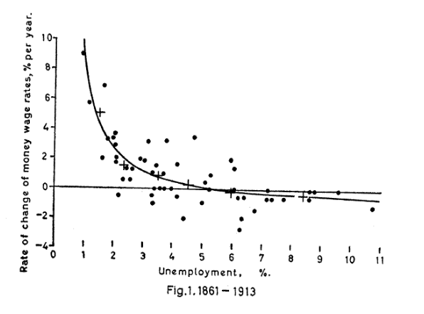

Proč vlastně DSGE modely vznikly a jaké byly jejich hlavní přínosy? Abychom si na tuto otázku odpověděli, musíme si vyjasnit další důležitý pojem, kterým je **Lucasova kritika**. Jedná se o kritiku (především) keynesiánských makroekonomických modelů, kterou formuloval americký ekonom **Robert Lucas**. Upozorňoval na fakt, že tyto modely v sobě neobsahují informaci o tom, **jak ekonomické subjekty reagují na změnu hospodářské politiky**.

Lucas svoji kritiku postavil zpočátku na **kritice klasické Phillipsovy křivky**. Připomeňme si, že Phillipsova křivka zobrazuje vztah mezi mzdovou inflací a nezaměstnaností.  Původní křivku sestrojil Phillips tak, že pozoroval historické hodnoty nezaměstnanosti a růstu mezd ve Spojeném království zhruba v období sto let. Hodnoty zanesl na dvourozměrnou souřadnicovou osu. Body tvořily (zhruba) klesající křivku. Nízké hodnoty nezaměstnanosti na této křivce odpovídaly vysokým hodnotám mzdové inflace (a naopak).

*Vztah mezi mzdovou inflací a nezaměstnaností ve Spojeném království za dané období. Zdroj: Phillips, A. W.: The Relation between Unemployment and the Rate of Change of Money Wage Rates in the United Kingdom, 1861-1957*

Obecně přijímaná interpretace křivky byla, že je možné (byť za cenu vysoké mzdové inflace) udržovat velmi nízkou úroveň nezaměstnanosti. V praxi se ale tento závěr ukázal jako mylný, když ekonomiky zažily období vysoké inflace a vysoké nezaměstnanosti. Podle Lucase byl problém v tom, že **zaměstnanci vysokou inflaci v budoucnosti očekávali a zahrnuli toto očekávání do svých výrobních rozhodnutí**.

Slovo očekávaní je zde velmi důležité. Fakt, že firmy a domácnosti nějakým způsobem kalkulují a predikují vývoj do budoucnosti, je komplikace pro hospodářskou politiku. Lucas dokonce formuloval **tezi o neúčinnosti hospodářské politiky**, protože racionální hospodářská politika je ekonomickými subjekty očekávána a ty na ni reagují. Racionálně ale neočekávají všechny subjekty, pouze v průměru. To znamená, že očekávaní některých subjektů jsou chybná a naopak ostatní subjekty tyto chyby využívají.

## Nový pohled na chování subjektů

Lucas rovněž kritizoval keynesiánské modely, které byly prakticky velmi využívané především v padesátých letech 20\. století. Typickým příkladem je takzvaný model s multiplikátorem, který se vyučuje v základních kurzech ekonomie. Ten pracuje s mezním sklonem ke spotřebě. Pokud získá spotřebitel dodatečné finance, tento pevně daný sklon ke spotřebě nám říká, kolik z této dodatečné částky dá domácnost na spotřebu a kolik uspoří. Dokáže ale takové extrémní zjednodušení uspokojivým způsobem vysvětlit jevy ve skutečné ekonomice? Není chování spotřebitelů složitější, nevyužívají spotřebitelé ke svému rozhodování větší množství informací? Podle Lucase ano.

Lucas navrhoval popisovat chování subjektů pomocí **deep parameters**. Volně bychom tento pojem překládali asi jako "pevné parametry", běžně se ale tento pojem nepřekládá. Deep parameters jsou parametry, které popisují chování domácností a jsou nezávislé na hospodářské politice. Příkladem může být třeba individuální preference volného času před spotřebou. Spotřebitel neustále stojí před dilematem, kolik času věnovat svojí práci. Na jedné straně dostává za práci mzdu, která mu umožňuje nakupovat spotřební zboží. Na druhé straně preferuje volný čas před časem stráveným v práci. Spotřebitel neustále vyvažuje tyto dvě skutečnosti.

Uvažujme, že pomocí nějaké číselné hodnoty můžeme vyjádřit individuální "nechuť spotřebitele k práci" neboli jeho subjektivní ocenění volného času. Skutečný čas, po který spotřebitel bude pracovat, se bude neustále měnit v závislosti na výši mezd, ceně spotřebního zboží, sazeb spotřebních daní a daní ze mzdy atd., ale toto subjektivní ocenění volného času zůstává pořád stejné. Naopak pokud bychom zvýšili ocenění volného času na úkor spotřeby, bude mít spotřebitel tendenci méně pracovat, než kolik by pracoval při původní hodnotě parametru. Tento rozdíl by byl pozorovatelný při různé hospodářské politice vlády. Tato hodnota tedy představuje jeden z možných deep parametrů.

Dalším takovým parametrem je diskontní faktor. Ten udává, jak důležitý je pro spotřebitele jeho užitek v budoucnosti ve srovnání se současností. Jinak řečeno, říká nám, nakolik je spotřebitel trpělivý a nakolik je ochotný obětovat část současného užitku výměnou za vyšší užitek v budoucnosti. Opět můžeme konstatovat, že chování spotřebitele je odrazem řady ekonomických jevů. Například úspory závisí na aktuální úrokové míře, zdanění úroků atd. Ale tato trpělivost spotřebitele je pevně daná.

Při konstrukci DSGE modelů se pro popis chování firem a domácností používají právě tyto deep parameters. Díky tomu jsou tyto modely **"odolné" vůči Lucasově kritice**.

## Zdroje

*   Martinčík, David: Vliv chování firem na hospodářský cyklus (DSGE přístup)
*   Holman, Robert: Dějiny ekonomického myšlení
*   Phillips, A. W.: The Relation between Unemployment and the Rate of Change of Money Wage Rates in the United Kingdom, 1861-1957003_lucasova_kritika.md
