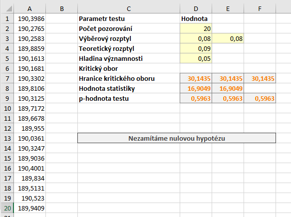

[Rozptyl](rozptyl.md) je ukazatelem variability. Ukazažele variability jsou měřítkem toho, nakolik jsou hodnoty souboru vzájemně různorodé. Chí-kvadrát test o rozptylu umožňuje ověřit hypotézu o rozptylu dat.

Uvažujeme následující příklad: *Máme zařízení, pomocí kterého vyrábíme součástky průměrné délky 190 mm. Výrobce garantuje, že maximální rozptyl délky součástky je 0,09 mm. Ověřte na hladině významnosti $ \alpha = 0{,}05 $, zda rozptyl délky překračuje hranici zadanou výrobcem.*

Dle zadání bychom měli provést jednostranný (pravostranný) test. Reálné příklady oboustranného testu by se hledaly poměrně složitě. Většinou požadujeme větší nebo naopak menší variabilitu, než je daná hranice.

Formulujme nejprve hypotézy testu:

* Nulová hypotéza: Rozptyl délky je 0,09. ($ H_0: \sigma^2 = 0{,}09 $)
* Alternativní hypotéza: Rozptyl délky je větší než 0,09. ($ H_1: \sigma^2 > 0{,}09 $)

## Výpočet v Excelu

Statistiku testu vypočteme ze vztahu

$ \chi^2 = \frac{(n - 1) s^2}{\sigma_0^2} \, ,$

kde $ n$ je rozsah výběru, $ \sigma_0^2$ je teoretický (testovaný, hypotetický) rozptyl a $ s$ je [výběrový rozptyl](rozptyl.md). Statistika je tedy poměrem teoretického a výběrového rozptylu, kterou násobíme rozsahem výběru. Jestliže je tedy například výběrový rozptyl výrazně větší než teoretický, má statistika relativně vysokou hodnotu. Naopak relativně nízké hodnoty svědčí o výrazně menším výběrovém rozptylu ve srovnání s teoretickým.

Statistika má $ \chi^2$ rozdělení. Toto rozdělení má jeden parametr, který nazýváme počet stupňů volnosti. Stupeň volnosti se rovná **počtu pozorování sníženému o jedničku**. Kritický obor tedy určíme pomocí kvantilů $ \chi^2$ jako

$ W = \langle \chi^2_{1 - \alpha} \left( n - 1 \right), \infty ) \, .$

Soubor s daty a výpočty naleznete [zde](media/chi-kvadrat-test-rozptyl/test-rozptyl.xlsx)

Nejprve určíme výběrový rozptyl. K tomu využijeme funkci VAR.S:

```
=VAR.S(A1:A20)
```

Pro určení **kritického oboru** máme dvě možnosti. Můžeme využít standardní kvantilovou funkci pro $ \chi^2$ rozdělení `CHISQ.INV`. Protože ale část rozdělení odpovídající hladině významnosti "odsekáváme" zprava, jako kvantil zadáváme $ 1 - \alpha$. Jako druhý parametr zadáváme počet stupňů volnosti. Vzorec pro výpočet je tedy

```
=CHISQ.INV(1-D5;D2-1)
```

Alternativně je možné využít funkci `CHISQ.INV.RT`. Jedná se o **pravostrannou kvantilovou funkci** $ \chi^2$ rozdělení, tj. již samotná funkce určuje z námi zadaného kvantilu jednotkový doplněk a tento kvantil standardního rozdělení pak vrací. Hranici kritického oboru tedy určíme vzorcem

```
=CHISQ.INV.RT(D5;D2-1)
```

Chceme-li zapsat hodnotu kritického oboru $ W$ intervalem, pak napíšeme:

$ W = \langle 30{,}1435, \infty ) \, .$

Hodnotu statistiky vypočteme jednoduše vzorcem

```
=(D2-1)*E3/D4
```

Hodnota statistiky je $ T = 16{,}9049 $, neleží tedy v kritickém oboru a tím pádem na dané hladině významnosti nulovou hypotézu nezamítáme.

## Určení p-hodnoty

K určení p-hodnoty máme opět k dispozici dvojici funkcí - `CHISQ.DIST` a `CHISQ.DIST.RT`. První je standardní distribuční funkcí $ \chi^2$ rozdělení, druhá funkce je pravostrannou distribuční funkcí $ \chi^2$ rozdělení. Tato funkce vrací plochu pod hustotou rozdělení napravo od zadané hodnoty. Jinak řečeno, vrací rozdíl mezi jedničkou a hodnotou distribuční funkce pro zadanou hodnotu.

Při využití funkce `CHISQ.DIST` musíme sami dopočítat doplněk hodnoty do jedničky, protože počítáme pravostranný test a p-hodnota se určuje jako plocha pod hustotou od hodnoty statistiky směrem napravo. Jako poslední parametr zadáváme PRAVDA, protože chceme hodnotu distribuční funkce, při zadání NEPRAVDA bychom získali hodnotu hustoty pravděpodobnosti. Správný vzorec tedy je:

```
=1-CHISQ.DIST(D8;D2-1;PRAVDA)
```

V případě pravostranné distribuční funkce žádnou úpravu již neprovádíme:

```
=CHISQ.DIST.RT(D8;D2-1)
```


