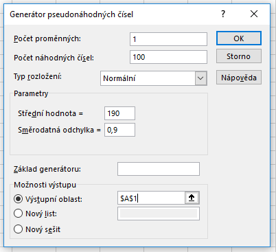
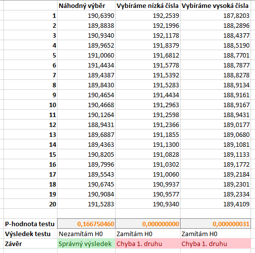
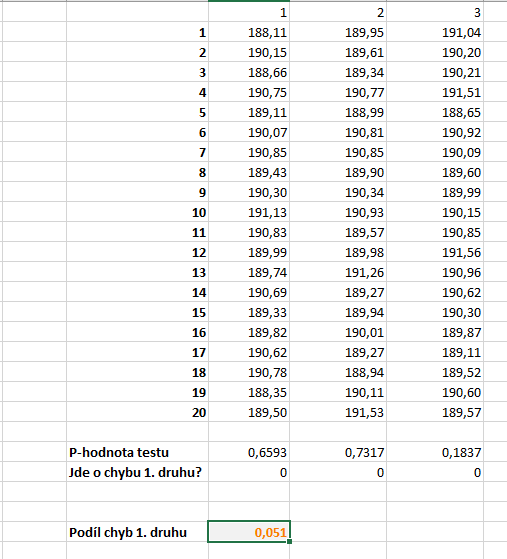
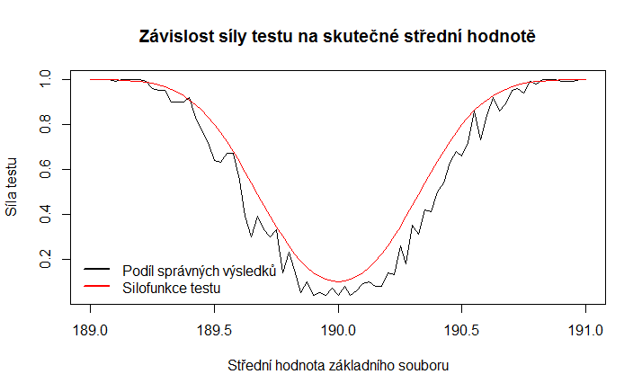

Pro někoho mohou být matoucí pojmy chyba 1\. druhu a chyba 2\. druhu. Protože tyto pojmy mohou být pro někoho obtížně pochopitelné nebo matoucí, ukážeme si nyní podrobně, jak tyto chyby mohou vzniknout a jak se projevují.

Zopakujme si, jak jsou tyto chyby definované. K chybě **1. druhu** dochází, jestliže **zamítneme nulovou (testovanou) hypotézu, i když tato hypotéza ve skutečnosti platí**. Pravděpodobnost této chyby si volíme sami a označujeme ji jako **hladinu významnosti**. Chyba **2. druhu** nastává, pokud **nezamítneme nulovou hypotézu, i když ve skutečnosti neplatí**. Tyto varianty se často zapisují jako [tabulka](chyby_pri_testovani.md).

Stejně jako v článku o [z-testu](z_test.md), budeme testovat hypotézu, že střední hodnota základního souboru je 190. Směrodatná odchylka, kterou známe, je 0,9\. Výběr pochází z normálního rozdělení.

Ukázkový soubor si můžete stáhnout zde: [chyby-pri-testech.xlsx](media/jak-vznikaji-chyby/chyby-pri-testech.xlsx).

## Chyba 1. druhu

Nejprve si musíme vygenerovat hodnoty, se kterými budeme pracovat. Microsoft Excel obsahuje funkci na generování náhodných čísel s požadovaným rozdělením a vlastnostmi. Na kartě **Data** klikneme na tlačítko **Analýza dat** a poté vybereme **Generátor pseudonáhodných čísel**. Pokud tlačítko Analýza dat nevidíme, znamená to, že v Excelu není nainstalován doplněk Analýza dat. Ten můžeme snadno doinstalovat [pomocí tohoto návodu](https://support.office.com/cs-cz/article/Zaveden%C3%AD-dopl%C5%88ku-Analytick%C3%A9-n%C3%A1stroje-6a63e598-cd6d-42e3-9317-6b40ba1a66b4).

*Poznámka: Postup, který provedeme, se běžně označuje jako numerická simulace. Při numerické simulaci provádíme výpočty na náhodně vygenerovaných čísel. U nich totiž (na rozdíl od reálných čísel) můžeme přesně nastavit jejich vlastnosti. V našem případě pak přesně víme, zda test vrací správný výsledek, nebo ne.*

Vygenerujeme si 100 náhodných čísel se střední hodnotou 190 a směrodatnou odchylkou 0,9\. Správné nastavení si můžete prohlédnout na obrázku níže.

Máme nyní k dispozici základní soubor, který má střední hodnotu 190\. Provedeme z toho souboru několik výběrů o rozsahu 20\. Výběry vidíte na obrázku níže. V prvním případě jsme vybrali prvních 20 hodnot. Ve druhém a třetím případě vybíráme 20 nejvyšších, resp. nejnižších hodnot. Tyto výběry určitě nejsou náhodné. Důležité však je, že k výběru těchto hodnot by mohlo (byť s velmi nízkou pravděpodobností) dojít i při náhodných výběrech.

Níže vidíme p-hodnoty testu nulové hypotézy a výsledky z-testů na hladině významnosti [latex] \alpha = 5 % [/latex]. **Protože my ale víme, že nulová hypotéza platí, můžeme i rozhodnout o tom, zda je výsledek testu správný nebo chybný.** V případě prvního výběru testovou hypotézu nezamítáme, což je správný výsledek. Při použití druhého a třetího výběru však nulovou hypotézu zamítáme, což je chybné rozhodnutí, protože nulová hypotéza platí. **Jde tedy o chybu 1. druhu.**

Výběry nejvyšších nebo nejnižších hodnot jsou "extrémní" metodou výběru. To dokazuje i extrémně nízká p-hodnota textu. K chybě 1\. druhu na [latex] \alpha = 5 % [/latex] by však došlo i v případě jiného výběru.

Ukážeme si nyní, že k chybě 1\. druhu může dojít i v případě čistě náhodného výběru. Zkusíme navíc provést velké množství náhodných výběrů a uvidíme, že k chybě 1\. druhu dochází přibližně v pěti procentech případů, což odpovídá hodnotě hladiny významnosti [latex] \alpha = 5 % [/latex].

Vygenerujeme si nyní (stejným postupem jako dříve) náhodný výběr o rozsahu 10 000 a provedeme 1 000 náhodných výběrů. K náhodnému výběru použijeme funkce INDEX a RANDBETWEEN. Funkce INDEX vybere _n_-tý řádek z námi zadaného pole hodnot. Číslo řádku chceme získat náhodně. K získání náhodného celého čísla použijeme funkci RANDBETWEEN pro rozsah od jedné do počtu hodnot v základním souboru, tj. 10000\. Jestliže máme hodnoty ve sloupci A, výsledný vzorec vypadá takto:

<pre>=INDEX($A$1:$A$10000;RANDBETWEEN(1;$I$6))</pre>

Pro každý náhodný výběr provedeme z-test pomocí funkce z-test. Poté zjistíme počet chyb 1\. druhu při testování. Použijeme funkci KDYŽ, která nám vrátí hodnotu 1, pokud došlo k chybě 1\. druhu, jinak 0.

<pre>=KDYŽ(Q23>$I$4;0;1)</pre>

Poté pomocí funkcí SUMA a počet zjistíme procentuální podíl chybných výsledků ve všech provedených testech.

<pre>=SUMA(Q24:AMB24)/POČET(Q24:AMB24)</pre>

Na obrázku níže vidíme, že tento procentuální podíl skutečně vychází přibližně 5 %.

V ukázkovém souboru se vám při každém opuštění buňky hodnoty přegenerují. To je způsobeno tím, že funkce RANDBETWEEN pokaždé generuje nová náhodná čísla.

Na následujícím obrázku červeně vidíte průměrnou hodnotu náhodných výběrů, pro které nulovou hypotézu zamítáme, a zeleně průměrné hodnoty výběrů, pro které ji nezamítáme. Nulovou hypotézu tedy zamítáme v případě, když je průměr náhodného výběru "příliš vzdálený" od teoretické střední hodnoty. Můžeme určit i interval pro průměr, pro který nulovou hodnotu ještě nezamítáme. Samozřejmě platí, že pro vyšší hladinu významnosti by tento interval byl širší.

## Chyba 2. druhu

Chyba druhého druhu nastává v jiné situaci. V našem příkladu jsme kontrolovali, zda pracovník správně nastavil stroj. Pokud však pracovník udělal chybu, je samozřejmě otázka, _jak velkou chybu_ udělal. Za správné nastavení považujeme 190 mm, za chybné třeba 189,9 mm, 191 mm nebo 170 mm. Intuitivně chápeme, že třetí variantu bychom odhalili mnohem snáze než druhou nebo první.

Ve statistice označujeme **pravděpodobnost, že k chybě 2\. druhu nedojde**, jako **sílu testu**. Ukážeme si, jak je síla testu závislá na skutečné střední hodnotě náhodného výběru.

Tentokrát ke generování nepoužijeme nástroj Analýza dat, protože budeme potřebovat vygenerovat řadu výběrů s různou střední hodnotou. Excel sice nemá přímo funkci na generování náhodných čísel z normálního rozdělení, můžeme však využít funkci NÁHČÍSLO pro generování náhodných čísel z rovnoměrného rozdělení a tuto funkci využít v kombinaci s funkcí NORM.INV. V buňkách H1 a D3 máme uloženou střední hodnotu a směrodatnou odchylku.

<pre>=NORM.INV(NÁHČÍSLO();H$1;$D$3)</pre>

Vygenerujeme si náhodné výběry se střední hodnotou od 189 do 191 s velikostí kroku 0,025\. Rozsah jednoho výběru bude 20\. Abychom získali rozumné výsledky, je třeba provést pro každou střední hodnotu větší množství výběrů. My provedeme 100\. Vygenerovanou sadu výběrů najdete v ukázkovém souboru.

Pod výběry je vypočteno, kolikrát byl výsledek testu chybný, tj. kolikrát nebyla zamítnuta chybná nulová hypotéza. Dále je výsledek našeho "empirického" pokusu srovnán s funkcí, který popisuje vztah mezi skutečnou střední hodnotou provedeného výběru a testovanou střední hodnotou. Tento vztah se v literatuře označuje jako **silofunkce testu**.

Na obrázku vidíme, že náš pokus byl poměrně hrubým odhadem silofunkce, i z něj je však patrná základní myšlenka. **Síla testu je tím nižší, čím blíže jsou si hypotetická a skutečná střední hodnota.** Nebo také můžeme říci, že větší rozdíly mezi oběma hodnotami je snazší odhalit. Přesnější funkci bychom získali větším množstvím výběrů.

Pro úplnost doplňuji přesný vztah pro silofunkci z-testu:

[latex] \beta(\mu) = \Phi \left( \frac{\mu_0 - \mu}{\sigma} \sqrt{n} + u_{1-\frac{\alpha}{2}} \right) + \Phi \left( \, \frac{\mu_0 - \mu}{\sigma} \sqrt{n} + u_{\frac{\alpha}{2}} \right) \, ,[/latex]

kde [latex] \Phi [/latex] označuje distribuční funkci normovaného normálního rozdělení, [latex] \mu_0 [/latex] skutečnou střední hodnotu základního souboru, [latex] \mu [/latex] teoretickou (testovanou) střední hodnotu, [latex] \sigma [/latex] známou směrodatnou odchylku, [latex] \alpha [/latex] hladinu významnosti testu a [latex] n [/latex] rozsah náhodného výběru.
