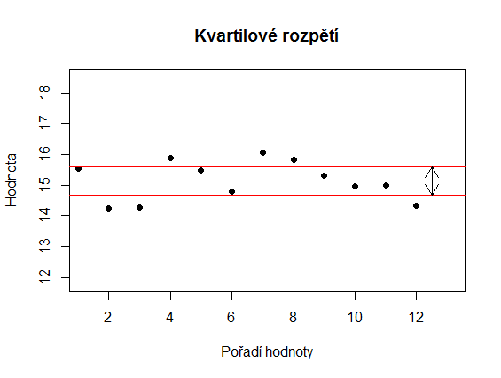
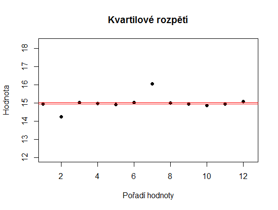
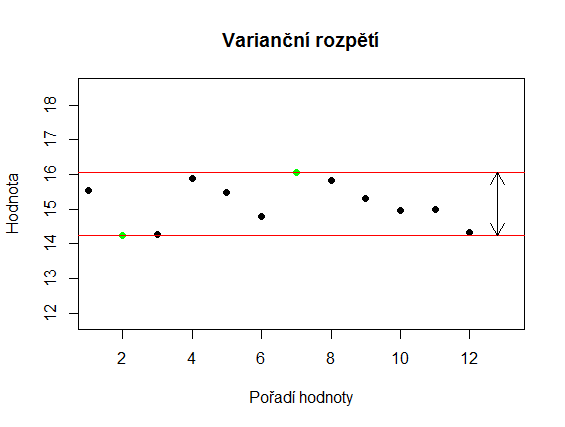
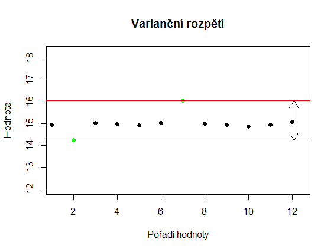
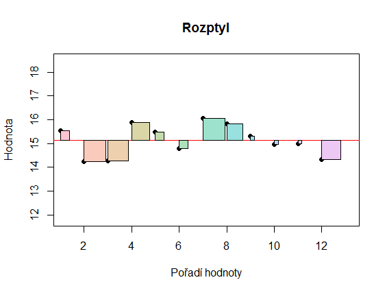
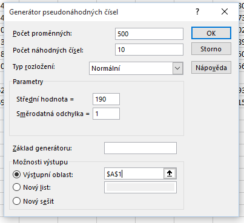
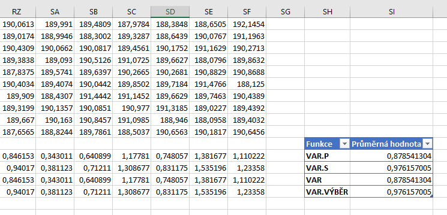
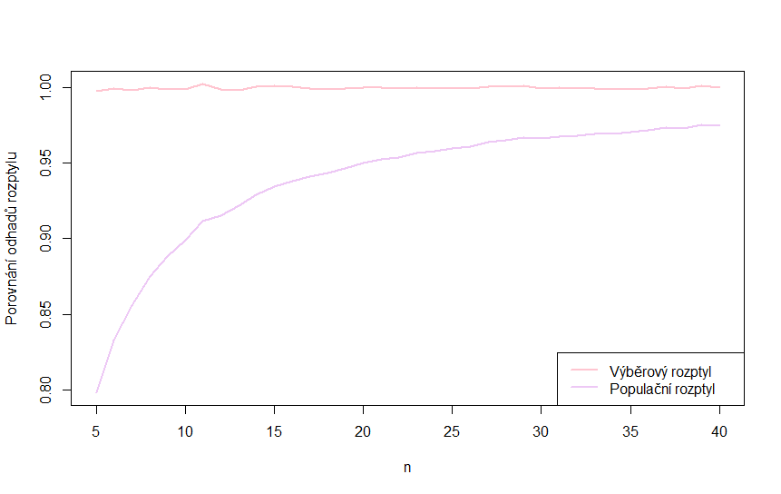

Střední hodnota je nejznámějším ukazatelem polohy. Ukazatele polohy charakterizují určitou úroveň hodnot v souboru. Dále se ale můžeme zajímat o to, nakolik jsou hodnoty souboru **diverzifikované** neboli **vzájemně rozdílné**. To určujeme pomocí **ukazatelů variability**. Například průměrný počet bodů z testu ve škole popisuje průměrnou úroveň znalostí studentů. Rozptyl bodů nám pak říká, jaké jsou mezi jednotlivými studenty rozdíly. Pokud je rozptyl velký, znamená to, že jednotliví studenti se vzájemně velmi liší svými vědomostmi. Čím je rozptyl nižší, tím jsou si jednotliví studenti svými výkony bližší.

Ukazatelů variability existuje více. Jedním z nejvíce intuitivních je rozdíl mezi největší a nejmenší hodnotou, který se označuje jako **varianční rozpětí**. Jeho hlavní výhodou je (nebo spíše dříve bývalo), že u menších souborů je rychle zjistitelné z hlavy nebo pomocí kalkulačky. To ale souvisí s jeho hlavní nevýhodou - z celého souboru dat využívá pouze dvě čísla. Může být tedy snadno ovlivněné odlehlými hodnotami.

Na obrázcích níže jsou dva soubory, jejichž varianční rozpětí je stejné, přestože je zřejmé, že hodnoty druhého souboru jsou více homogenní.





Tuto nevýhodu částečně odstraňuje **kvartilové rozpětí**. Jedná se o rozdíl mezi prvním a třetím kvartilem. První kvartil je hodnota, pro kterou platí, že přesně 25 % hodnot souboru je menší nebo rovno tomuto rozpětí. Pro třetí kvartil platí, že přesně 75 % hodnot je menší nebo rovno dané hodnotě. Kromě kvartilového rozpětí se někdy ještě používá **kvantilové rozpětí**, což je rozdíl mezi nejnižším a nejvyšším kvantilem. Níže vidíte, že kvartilové rozpětí odhalilo nižší variabilitu druhého souboru.





Základním ukazatelem variability je však **rozptyl**, který obvykle značíme $ \sigma^2$. Obecně je rozptyl náhodné veličiny $ X$ definovaný vztahem
$ \sigma^2_X = \mathbb{E} \left( \left[ X - \mathbb{E} \left(X \right) \right]^2 \right) \, ,$

tj. jako střední hodnota rozdílu mezi hodnotami veličiny $ X$ a její střední hodnotou umocněného na druhou.

Máme-li k dispozici **všechny hodnoty náhodného souboru**, vypočteme rozptyl pomocí vzorce
$ \sigma^2_X = \frac{1}{n} \sum\limits_{i=1}^{n} \left[ x_i - \mathbb{E} \left(X \right) \right]^2 \, .$

Chceme-li určit rozptyl náhodného souboru, vypočteme **rozdíl mezi každou hodnotou náhodného souboru a průměrem souboru a ten umocníme na druhou**. Rozptyl je pak součet všech těchto hodnot.

Tento vzorec se někdy označuje jako **populační rozptyl**, aby se odlišil od výběrového rozptylu, který si popíšeme níže.

Vyjádřeme si hodnotu rozptylu graficky. Rozdíl mezi *i*-tou hodnotou a průměrem umocněný na druhou odpovídá ploše čtverce, u něhož je délka hrany rovná právě (absolutní) hodnotě tohoto rozdílu. Tyto čtverce vidíme na obrázku níže. Rozptyl je pak rovný součtu ploch jednotlivých čtverců.



Rozptyl využívá všechny hodnoty náhodného souboru, což, jak již víme, lze považovat za výhodu i nevýhodu. Obecně se ale rozptyl považuje za nejoblíbenější ukazatel variability a je ve statistice hojně používán. Často třeba určujeme hodnoty parametrů statistických modelů tak, abychom minimalizovali rozptyl našich dat. To souvisí i s tím, že druhou mocninu lze snadno derivovat.

Kromě rozptylu často používáme směrodatnou odchylku, která je odmocninou rozptylu. Směrodatná odchylka se často značí $ \sigma$ a platí tedy vztah
$ \sigma_X = \sqrt{\sigma^2_X} = \sqrt{\frac{1}{n} \sum\limits_{i=1}^{n} \left[ x_i - \mathbb{E} \left(X \right) \right]^2} \, .$

Pokud **nemáme k dispozici všechny hodnoty souboru**, ale pouze nějaký omezený náhodný výběr, musíme hodnotu rozptylu odhadnout. K odhadu rozptylu se používá **výběrový rozptyl**, který značíme $ s^2$ a vypočteme ho pomocí vzorce:
$ s^2_X = \frac{1}{n-1} \sum\limits_{i=1}^{n} \left( x_i - \bar{x} \right)^2 \, .$

Rozdíl oproti předchozímu vzorci je v tom, že sumu násobíme zlomkem $ \frac{1}{n-1}$ namísto $ \frac{1}{n}$. Proč volíme tento vzorec? Výběrový rozdíl má totiž důležitou vlastnost v tom, že je **nestranným odhadem** rozptylu základního souboru. Nestranností odhadu rozumíme to, že **střední hodnota odhadu se rovná skutečné hodnotě odhadovaného souboru**. Odhad, který není nestranný, je tedy nějakým způsobem **zkreslený**.

Ukažme si to na konkrétních datech. V Excelu si vygenerujeme 500 náhodných výběrů z normálního rozdělení se střední hodnotou $ \mu = 190 $ a rozptylem $ \sigma^2 = 1 $.



Hodnoty výběru pak máme v buňkách A1:A10, B1:B10 a dalších. Pro výpočet rozptylu použijeme vzorec

```
VAR.P(A1:A10)
```

a pro výpočet výběrového rozptylu vzorec

```
VAR.S(A1:A10)
```

Tyto vzorce pak roztáhneme doprava. Dále vypočteme průměr z rozptylů vypočtených pomocí všech čtyř vzorců. Na obrázku níže vidíte výsledky. Vidíme, že výběrových rozptylů je skutečné hodnotě rozptylu blíže.



Soubor s výpočty si můžete stáhnout zde: [rozptyl](media/rozptyl/rozptyl.xlsx).

Výběrový rozptyl bychom také mohli získat vynásobením vzorce pro populační rozptyl výrazem $ \frac{n}{n-1}$. Čím vyšší je $ n $, tím je hodnota tohoto výrazu bližší 1 a tím pádem i klesá rozdíl mezi oběma rozptyly. Pro velké výběry je pak v zásadě jedno, který ze vzorců použijeme.

Rozdíl mezi oběma vzorci je vidět na obrázku níže. Vidíme, jak pro se rostoucí rozsah náhodného výběru blíží průměrná hodnota populačního rozptylu k průměrné hodnotě výběrového rozptylu.



Ještě malý dodatek. Víme, že limita
$ \lim_{n\to\infty} \frac{n}{n-1} = 1 \, . $

Odhady rozptylu pomocí vzorce pro populační rozptyl je takzvaným **asymptoticky nestranným odhadem**, protože pro rostoucí $ n $ konverguje střední hodnota odhadu ke skutečné hodnotě rozptylu.
