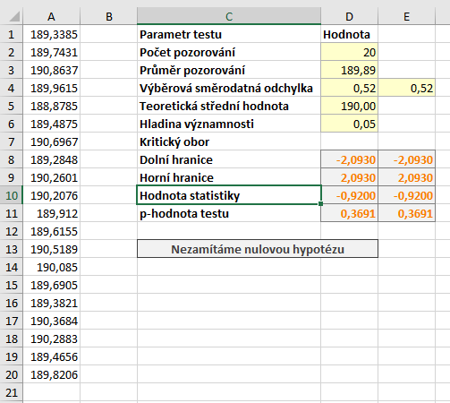

Zásadním omezením [z-testu](z_test.md), je nutnost znát rozptyl testovaného souboru. V realitě rozptyl velmi často neznáme, a tak se musíme spokojit s jeho **odhadem**. V takovém případě musíme využít určitou "modifikaci" z-testu, která se nazývá t-test. Ten je používán ke stejnému účelu jako z-test, tedy k ověření hypotézy o střední hodnotě souboru.

Uvažujeme následující příklad: *Máme zařízení, které vyrábí součástku určité délky. Zařízení má určitou chybovost, jejíž přesnou velikost neznáme. Zařízení bylo nastaveno pracovníkem a my chceme ověřit, že pracovník nastavil správnou délku součástky, tj. 190 mm. Pro ověření jsme vybrali a přeměřili náhodný soubor dvaceti součástek.*

Soubor s daty i výpočty si můžete stáhnout [zde](media/t-test/t-test.xlsx).

Obecné principy testování hypotéz, které jsme si popsali v článku o z-testu, zůstávají v platnosti. Definujeme si tedy nulovou a alternativní hypotézu:

* Nulová hypotéza: Střední hodnota statistického souboru je 190 mm. ($ H_0: \mu = 190 \, \mathrm{mm}$)
* Alternativní hypotéza: Střední hodnota statistického souboru je není 190 mm. ($ H_1: \mu \neq 190 \, \mathrm{mm}$.)

Stejně jako u z-testu můžeme u t-testu formulovat [pravostrannou](t_test_pravostranny.md) a [levostrannou](t_test_levostranny.md) variantu.

Statistiku získáme ze vzorce

$ t = \frac{\bar{x} - \mu_0}{s} \sqrt{n} \, ,$

kde $ \bar{x}$ je průměr našeho vzorku, $ \mu_0$ je teoretická (testovaná) střední hodnota, a $ n$ je rozsah náhodného výběru. Proměnná $ s$ je odhad rozptylu základního souboru a pro tento odhad využijeme [výběrový rozptyl](rozptyl.md).

Naše statistika $ t$ nemá tentokrát normované rozdělení, ale má takzvané **Studentovo** neboli **t rozdělení**. Toto rozdělení má jeden parametr, který značíme $ \nu $. V našem případě platí vztah $ \nu = n - 1 \, . $

t rozdělení má podobné vlastnosti jako normované normální: jeho **střední hodnota je 0** a je **symetrické kolem 0**. Čím vyšší je hodnota parametru $ \nu $, tím více se distribuční funkce t rozdělení blíží normovanému normálnímu. Často se uvádí, že u t-testu můžeme pro $ \nu > 30 $ použít normované normální rozdělení. Pokud však i pro tyto hodnoty použijeme t rozdělení, nejedná se o chybu.

Kvantilvou funkci t rozdělení s $ (\nu)$ stupni volnosti budeme značit  $ t_{p} (\nu)$. Kritický obor testu určíme ze vzorce

$ W = ( - \infty, t_{\frac{\alpha}{2}} \left(n-1 \right) \rangle \cup \langle t_{1-\frac{\alpha}{2}} \left( n - 1 \right), \infty ) \, ,$

kde $ \alpha$ značí hladinu významnosti testu.

## Výpočet v Excelu

Nyní již víme vše, co potřebujeme, a můžeme se vrhnout na provedení testu v Excelu.

Náš testovací soubor máme uložený v buňkách A1 až A20. Test provedeme na $ \alpha = 5 % $, tuto hodnotu máme v buňce D6.



K provedení t-testu potřebujeme výběrovou směrodatnou odchylku souboru. Směrodatnou odchylku získáme vzorcem

```
=SMODCH.VÝBĚR.S(A1:A20)
```

Hodnotu si uložíme do buňky D4. Teoretickou střední hodnotu máme v buňce D10, průměr náhodného souboru v buňce D3. Nyní určíme kritický obor. Využijeme kvantilovou funkci Excelu pro t rozdělení - `T.INV`. Dolní hranici kritického oboru získáme vzorcem

```
=T.INV(D6/2;D2-1)
```

a horní hranici vzorcem

```
=T.INV(1-D6/2;D2-1)
```

Důležité je, že funkce T.INV **obsahuje v názvu tečku**. Nepleťte si tuto funkci se starší funkcí TINV, která vrací jiné výsledky.

Hodnoty se liší pouze znaménkem, protože (jak už jsme uvedli) je t rozdělení symetrické kolem 0. Ze získaných hodnot můžeme kritický obor zapsat intervalem:

$ W = ( - \infty, -2,0930 \rangle \cup \langle 2,0930, \infty ) \, .$

Nyní si určíme hodnotu statistiky (pomocí vzorce $ t = \frac{\bar{x} - \mu_0}{s} \sqrt{n}$):

```
=(D3-D5)/D4*ODMOCNINA(D2)
```

Hodnota statistiky je -0,92 a výsledek máme v buňce D10. Protože statistika leží mimo kritický obor, **nulovou hypotézu nezamítáme**. Určeme si ještě p-hodnotu testu. K tomu využijeme distribuční funkci t rozdělení T.DIST:

```
=T.DIST(D10;D2-1;PRAVDA) * 2
```

V tomto případě určujeme p-hodnotu jako plochu pod hustotou statistiky směrem doleva a násobíme ji dvěma. Pokud bychom však měli hodnotu statistiky vyšší než 0, je třeba určovat p-hodnotu jako plochu od statistiky směrem doprava. K tomu můžeme využít funkci `T.DIST.RT`, která určuje kvantily t rozdělení zprava. Správná hodnota bude vždy ta menší.
