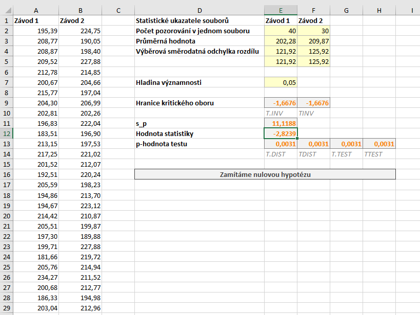
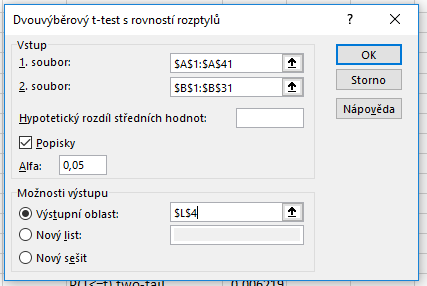
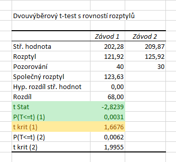

Nyní se budeme zabývat situací, kdy máme dva soubory, přičemž pozorování z obou souborů **nelze spárovat**. Soubory tedy mohou mít i odlišný počet pozorování. Předpokládáme však, že soubory mají **shodné rozptyly**. V takovém případě použijeme dvouvýběrový t-test, někdy též označovaný jako dvouvýběrový Studentův test.

Soubor se všemi výpočty naleznete [zde](media/t-test-dvouvyberovy/dvouvyberovy_t-test.xlsx).

Abychom si přesně ukázali odlišnost od párového t-testu, vyjdeme ze zadání podobného tomu minulému: *Máme data o průměrném počtu vyrobených výrobků pracovníky **ve dvou různých závodech**, přičemž v jednom ze závodů jsou testovány nové výrobní procesy. Vedení společnosti potřebuje ověřit, zda nové výrobní postupy zvýšily produktivitu práce, a v závislosti na tom implementuje tyto postupy v dalších závodech. Ověřte na $ \alpha = 5 %$ hypotézu, že v závodě s novými výrobními postupy vyrobí pracovníci v průměru více výrobků, než v závodě s původními postupy, přičemž předpokládáme, že **rozptyl** průměrného počtu výrobků **je v obou závodech stejný**. Vedení v minulosti statisticky ověřilo, že před změnou procesů byli pracovníci v obou závodech v průměru stejně výkonní.*

Protože porovnáváme dva různé závody, nemůžeme pozorování nijak spárovat. Naopak předpokládáme shodný rozptyl hodnot, proto můžeme použít dvouvýběrový t-test.

Soubor $ X_1$ obsahuje pozorování ze závodu se starými postupy a soubor $ X_2$ pozorování ze závodu s upravenými postupy. Příslušné střední hodnoty pak označíme $ \mu_{X_1}$ a $ \mu_{X_2}$. Nyní můžeme formulovat nulovou a alternativní hypotézu:

* $ H_0: \mu_{X_1} = \mu_{X_2} \, .$ (Střední hodnota obou souborů je stejná.)
* $ H_1: \mu_{X_1} < \mu_{X_2} \, .$ (Střední hodnota prvního souboru je nižší.)

Alternativní hypotéza nám tedy říká, že pracovníci vyrábějící podle nových postupů jsou v průměru výkonnější.

Definujme si statistiku testu $ T$ jako

$ T = \frac{\bar{X_1} - \bar{X_2}}{s_p \cdot \sqrt{\frac{1}{n1} + \frac{1}{n2}}} \, ,$

kde $ n_1$ a $ n_2$ jsou rozsahy obou souborů a $ s_p$ určíme ze vzorce

$ s_p = \frac{(n_1 - 1)s^2_{X_1} + (n_2 - 1)s^2_{X_2}}{n_1 + n_2 - 2} \, ,$

kde $ s^2_{X_1}$ a $ s^2_{X_2}$ jsou výběrové rozptyly obou souborů. Statistika $ T$ má samozřejmě Studentovo rozdělení a kritický obor určíme ze vztahu

$ W = ( - \infty,  t_{\alpha} (n_1 + n_2 - 2) \rangle $

Dvouvýběrový t-test můžeme v Excelu opět provést několika způsoby:

* použitím doplňku Analýza dat,
* použitím funkce T.TEST (nebo TTEST),
* použitím funkcí pro kvantilovou a distribuční funkci Studentova rozdělení.

Modelová data najdete na obrázku níže, rozsah dat je $ n_1 = 40 $ a $ n_2 = 30$.



## Výpočet s využitím doplňku Analýza dat

Začneme s využitím doplňku Analýza dat. Ten spustíme kliknutím na tlačítko Analýza dat na panelu Data. Vybereme možnost Dvouvýběrový t-test s rovností rozptylů. Do políček 1. soubor a 2. soubor označíme umístění našich souborů. Pokud označíme i záhlaví tabulky, zaškrtneme možnost Popisky. V poli Alfa necháme výchozí hodnotu $ 0,05$ a do pole Výstupní oblast vložíme hranici oblasti, do které budou vloženy výsledky.



Výsledky pro naše data jsou na obrázku níže. Hodnota statistiky je pro oba typy testu stejná a najdeme ji v řádku t Stat, v našem případě tedy $ T = -2{,}8239$. Při jednostranném testu nás dále zajímají řádky, které jsou označeny (1).



Řádek P(T<=t) (1) obsahuje p-hodnotu testu. Opět ale platí, že na tuto hodnotu si musíme dát pozor, protože nemusí vždy odpovídat našemu zadání. V doplňku totiž neurčujeme alternativní hypotézu. Excel **vrací tu ze dvou možných p-hodnot, která je menší než 0,5**. V našem případě (a obecně v případě záporné hodnoty statistiky, resp. v případě vyšší hodnoty průměru prvního souboru) Excel vrací p-hodnotu pro levostranný t-test, což odpovídá našemu zadání. p-hodnota testu je tedy $ T = 0{,}0031$. V posledním označeném řádku nalezneme hranici kritického oboru. Opět platí, že hranice je zobrazena v absolutní hodnotě. V našem případě máme levostranný test, odsekáváme tedy rozdělení statistiky zleva. Protože Studentovo rozdělení je symetrické kolem nuly, stačí k zobrazené hodnotě připsat minus, tj. kritický obor se nachází v intervalu:

$ W = ( - \infty,  - 1,6676 \rangle $

## Využití funkce T.TEST (TTEST)

Výpočet s využitím funkce T.TEST (ve verzi 2007 a starších TTEST) je obdobný případu s párovým testem, měníme pouze poslední parametry. V případě nepárového testu se shodnými rozptyly souborů jako poslední parametr zadáváme 2. Jako první dva parametry zadáváme soubory s pozorováními a jako třeba parametr 1, protože provádíme jednostranný test. Výsledný vzorec je tedy:

```
T.TEST(A2:A41;B2:B31;1;2)
```

Funkce nám vrátí hodnotu $ 0,0031$, což je, jak už víme, správný výsledek. Tato funkce se ale chová obdobně jako Analýza dat, tj. ze dvou možných p-hodnot vrací tu nižší. V případě **záporné statistiky** (tedy v případě, kdy je průměr druhého souboru vyšší než prvního) je tento výsledek **správný**, obecně to ale **platit nemusí**. Z tvaru vzorce statistiky vidíme, že statistika je záporná právě tehdy, pokud má druhý soubor vyšší průměr. Vzorec tedy můžeme zjednodušit tím, že se rozhodneme na základě porovnání průměrů obou souborů. Fuunkce podmínky:

```
=KDYŽ(E3<F3;T.TEST(A2:A41;B2:B31;1;2);1-T.TEST(A2:A41;B2:B31;1;2))
```

V případě funkce TTEST postupujeme obdobně, tj. jednodušší varianta vzorce je

```
TEST(A2:A41;B2:B31;1;2)
```

a obecně funguje vzorec

```
=KDYŽ(E3<F3;TTEST(A2:A41;B2:B31;1;2);1-TTEST(A2:A41;B2:B31;1;2))
```

## Manuální výpočet

Poslední možností je provést výpočty "ručně", tj. pomocí funkcí pro distribuční a kvantilovou funkci Studentova rozdělení. Pro výpočet statistiky potřebujeme průměr a výběrový rozptyl, které snadno vypočítáme pomocí funkcí PRŮMĚR a VAR.S (u starších verzí VAR.VÝBĚR).

Uveďme si nejprve vzorec pro výpočet statistiky:

```
=(E3-F3)/(E11*ODMOCNINA(1/E2+1/F2))
```
Hranice kritického oboru určíme pomocí funkce T.INV, tj. pomocí kvantilové funkce Studentova rozdělení. Funkce T.INV se chová naprosto standardně. U levostranného testu odsekáváme kritický obor zleva, jako kvantil tedy zadáváme hladinu významnosti, tj. $ \alpha = 5 %$. Počet stupňů volnosti je $ n_1 + n_2 - 2$, tj. výsledný vzorece je:

```
=T.INV(E7;E2+F2-2)
```

Kritický obor je tedy:

$ W = ( - \infty,  - 1,6676 \rangle $.

p-hodnotu určíme pomocí funkce T.DIST. U levostranného testu určujeme p-hodnotu zleva, použijeme tedy funkci Studentova rozdělení T.DIST. Tato funkce se opět chová zcela standardně, stačí tedy zadat hodnotu statistiky a počet stupňů volnosti a výsledek nijak neupravujeme:

```
=T.DIST(E12;E2+F2-2;PRAVDA)
```
