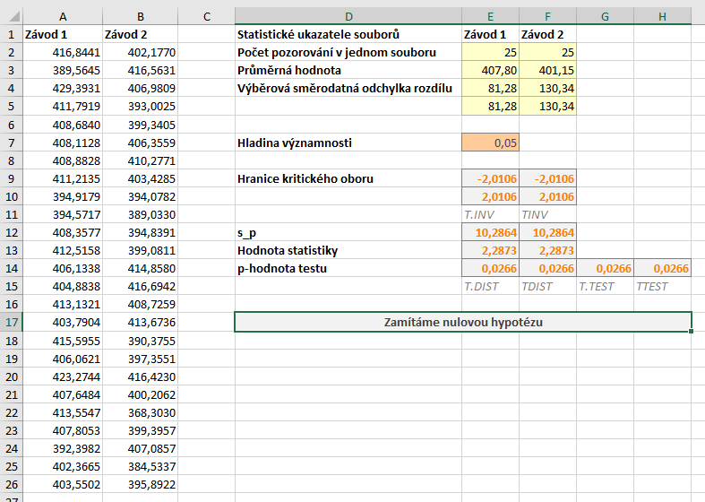
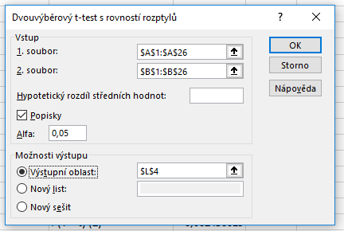
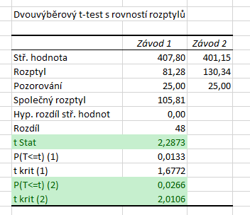

Poslední variantou je oboustranný test. Opět si upravíme zadání příkladu: *Máme data o počtu vyrobených výrobků pracovníky za jednu směnu ve dvou různých závodech jedné společnosti. Ověřte na $ \alpha = 5 %$ hypotézu, že mezi těmito dvěma závody existuje statisticky významný rozdíl v průměrném počtu vyrobených výrobků.*

V tomto případě se v zadání nepřikláníme na jednu ani na druhou stranu, tj. alternativní hypotéza platí jak v případě, že první závod bude v průměru lepší, tak i v případě, že bude v průměru horší.

Hypotézy našeho testu jsou následující:

* $ H_0: \mu_{X_1} = \mu_{X_2} \, .$ (Střední hodnota obou souborů je stejná.)
* $ H_1: \mu_{X_1} \neq \mu_{X_2} \, .$ (Střední hodnota souborů se liší.)

Vzorec pro výpočet statistiky zůstává stejný, kritický obor se (jako v případě předchozích oboustranných testů) skládá z dvou intervalů:

$ W = ( -\infty,  t_{\frac{\alpha}{2}} (n_1 + n_2 - 2) \rangle \cup \langle t_{1-\frac{\alpha}{2}} (n_1 + n_2 - 2), \infty ) $

List s daty je na obrázku níže.



Soubor se všemi výpočty naleznete [zde](media/t-test-dvouvyberovy-oboustranny/dvouvyberovy_t-test.xlsx).

Všimněte si, že rozsah obou souborů je stejný, vzhledem k charakteru dat ale nelze použít párový t-test.

## Výpočet s využitím doplňku Analýza dat

Výpočet spustíme obdobným postupem jako výše.



Níže vidíme výsledky. Hodnotu testové statistiky nalezneme stále na stejném místě, tj. $ T = 2{,}2873$. Dále nás budou zajímat poslední dva řádky. Poslední řádek obsahuje hranici kritického oboru, resp. jeho horní hranici. Dolní hranice je v absolutní hodnotě stejná jako horní, je však záporná, neboť Studentovo rozdělení je symetrické.



Kritický obor tedy je

$ W = ( -\infty, - 2{,}0106 \rangle \cup \langle -2{,}0106, \infty ) \, .$

V předposledním řádku je p-hodnota. Ta je v případě oboustranného testu vždy správná, tj. p-hodnota našeho testu je $ 0{,}0266$. Za tabulky vidíme, že

* p-hodnota je menší než hladina významnosti ($ 0{,}05 > 0{,}0266$),
* hodnota statistiky se nachází v kritickém oboru ($ 2{,}2873 \in \langle 2{,}0106, \infty ) $),

zamítáme tedy nulovou hypotézu. Na hladině významnosti $ \alpha = 5 %$ jsme tedy prokázali, že mezi oběma závody existuje rozdíl. Nemůžeme však tvrdit, že by první závod byl lepší než druhý, pouze existenci rozdílu!

## Využití funkce T.TEST

V případě oboustranného testu je použití funkce T.TEST jednoduché. Jako poslední parametr zadáváme 2. Vrácená p-hodnota je vždy správná bez ohledu na hodnotu statistiky, tj. vzorec pro funkci T.TEST je

```
=T.TEST(A2:A26;B2:B26;2;2)
```

a pro starší funkcí TTEST pak

```
=TTEST(A2:A26;B2:B26;2;2)
```

## Manuální výpočet

Výpočet statistiky opět zůstává stejný.

V případě oboustranného testu určujeme dolní a horní hranici kritického oboru. Při použití funkce T.INV určíme dolní hranici jako

```
=T.INV(E7/2;E2+F2-2)
```
a horní hranici, která se od dolní liší pouze znaménkem, pak

```
=T.INV(1-E7/2;E2+F2-2)
```

Alternativně je samozřejmě možné před vzorec pro dolní hranici napsat minus nebo použít funkci T.INV.RT.

Určení p-hodnoty je nyní tentokrát mírně složitější. U oboustranného testu určujeme p-hodnotu vždy směrem k bližšímu kraji číselné osy, tj. pro záporné statistiky doleva a pro kladné doprava. Výsledek poté musíme násobit dvěma. Při použití funkce KDYŽ můžeme vytvořit obecně platný vzorec jako

```
=KDYŽ(E12<0;T.DIST(E13;E2+F2-2;PRAVDA);1-T.DIST(E13;E2+F2-2;PRAVDA))*2
```

Alternativně je možné použít funkci MIN, protože horní podmínky vždy vybere tu nižší z obou variant

```
=MIN(T.DIST(E13;E2+F2-2;PRAVDA);1-T.DIST(E13;E2+F2-2;PRAVDA))*2
```

Chceme-li si ušetřit práci, můžeme použít funkci T.DIST.2T. To je obdoba funkce TDIST ze starších verzí Excelu, tj. pracuje s upraveným Studentovým rozdělením, jehož hustota nabývá kladných hodnot pouze pro kladná čísla, je zde však dvojnásobná oproti běžná hustotě. Dáme-li této funkci absolutní hodnotu statistiky, pak nám tedy vrátí rovnou p-hodnotu.

```
=T.DIST.2T(ABS(E13);E2+F2-2)
```
