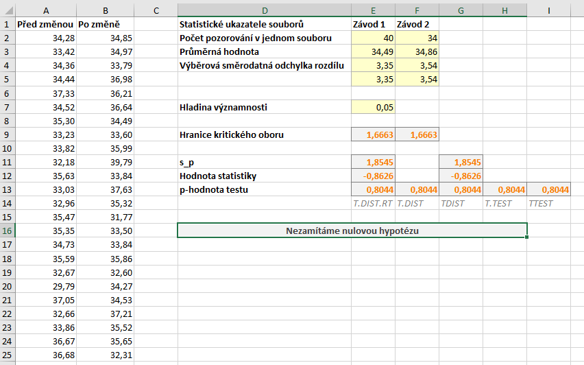
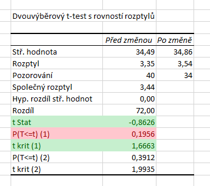
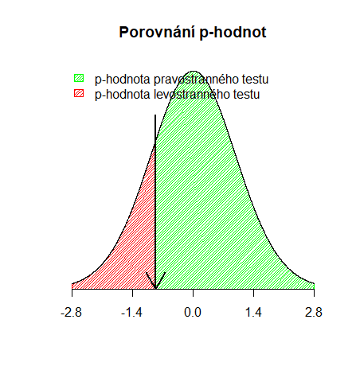

Nyní si ukážeme postup při pravostranném testu. Upravme si nejprve předchozí zadání: *Máme data o průměrném počtu výrobků, které neprošly kontrolou kvality (tj. zmetků), vyrobených **ve dvou různých závodech**, přičemž druhý závod postupuje podle upravených výrobních procesů. Předpokládáme, že počty mají v obou případech shodný rozptyl. Ověřte hypotézu, že změna výrobních postupů vedla ke snížení zmetkovosti.*

Hypotézy našeho testu jsou následující:

* $ H_0: \mu_{X_1} = \mu_{X_2} \, .$ (Střední hodnota obou souborů je stejná.)
* $ H_1: \mu_{X_1} < \mu_{X_2} \, .$ (Střední hodnota prvního souboru je vyšší.)

Statistika testu zůstává stejná, kritický obor se přesunuje doprava, tj.:

$ W = \langle t_{1-\alpha} (n_1 + n_2 - 2) \infty ) $



Soubor se všemi výpočty naleznete [zde](media/t-test-dvouvyberovy-pravostranny/dvouvyberovy_t-test.xlsx).

## Výpočet s využitím doplňku Analýza dat

Výpočet spustíme pomocí stejného postupu, jako jsme si uvedli výše, tj. označíme oblasti s daty a výstupní oblast. Níže máme výsledek výpočtu. Hodnota statistiky je $ T = - 0{,}8626$ a tentokrát máme správně určenou i hranici kritického oboru, kritický obor je tedy

$ W = \langle 1{,}6663, \infty ) \, .$



Špatně je ale p-hodnota. Hodnota statistiky je záporná a protože kritický obor určujeme zprava, musí být p-hodnota vyšší než $ 0{,}5$. Dochází zde tedy k problému, který jsme si popisovali výše. Tato p-hodnota by byla **správná v případě levostranného testu**. V případě pravostranného testu je ale $ 1 - 0{,}1956 = 0{,}8044$.

Porovnání p-hodnot je na grafu níže. Červeně je označena p-hodnota levostranného testu, zeleně p-hodnota pravostranného.



## Využití funkce T.TEST

Podobně jako Analýza dat, i funkce T.TEST v jednodušší variantě vrací **chybný výsledek**. Pří použití následujícího vzorce

```
T.TEST(A2:A41;B2:B35;1;2)
```

získáme hodnotu $ 0{,}1956$, který by byla správná, pokud bychom dělali levostranný test.

Použijme tedy opět funkci podmínky. Tento vzorec je stejný jako výše s výjimkou znaménka u podmínky, které je obráceně.

```
=KDYŽ(E3>F3;T.TEST(A2:A41;B2:B35;1;2);1-T.TEST(A2:A41;B2:B35;1;2))
```

## Manuální výpočet

Vzorec pro výpočet statistiky zůstává stejný, proto rovnou přejdeme k dalším krokům.

Kritický obor tentokrát určujeme zprava. Do kritického oboru budou patřit nejvyšší hodnoty z definičního oboru tak, že pravděpodobnost, že testová statistika nabude těchto hodnot, bude přesně $ \alpha$, v našem případě $ \alpha = 0{,}05$. Zbylé hodnoty, u nichž je tato pravděpodobnost $ 1 - \alpha = 1 - 0{,}05 = 0{,}95$, jsou mimo kritický obor. Jak první parametr inverzní distribuční funkce Studentova rozdělení T.INV tedy zadáme $ 1 - \alpha$, ostatní se nemění:

```
=T.INV(1-E7;E2+F2-2)
```

Kritický obor je tedy:

$ W = \langle 1{,}6663, \infty) $.

p-hodnotu určíme pomocí funkce T.DIST a to opět směrem doprava, tj:

```
=1-T.DIST(E12;E2+F2-2;PRAVDA)
```

Můžeme rovněž použít pravostrannou distribuční funkci T.DIST.RT, která nám zápis trochu zjednoduší:

```
=T.DIST.RT(E12;E2+F2-2)
```
