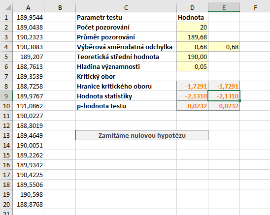

Poslední možností formulace alternativní hypotézy [t-testu](t_test.md) je levostranný test, kdy v alternativní hypotéze tvrdíme, že soubor má střední hodnotu menší než 190 mm.

Zadání příkladu by bylo obdobou zadání u [z-testu](z_test_levostranny.md) s tím rozdílem, že zde neznáme směrodatnou odchylku dat a musíme ji odhadovat. Při levostranném testu se rozhodujeme mezi těmito hypotézami:

* Nulová hypotéza: Středné hodnota souboru je 190 mm. ($latex H_0: \mu = 190 \, \mathrm{mm}$)
* Alternativní hypotéza: Střední hodnota souboru je menší než 190 mm. ($latex H_0: \mu < 190 \, \mathrm{mm}$)

Soubor s daty i výpočty si můžete stáhnout [zde](media/t-test/t-test.xlsx).

## Výpočet v Excelu

Testová statistika zůstává stejná a ve prospěch alternativní hypotézy mluví její velmi malé hodnoty. Kritický obor tedy "odsekáváme" zleva, tj. kritický obor vyjádřený intervalem má tvar

$ W = ( - \infty, t_{\alpha} \left(n-1 \right) \rangle \, .$



Směrodatnou odchylku určíme pomocí funkce

```
=SMODCH.VÝBĚR.S(A1:A20)
```

Kritický obor má pouze jednu hranici a $latex \alpha$-tý kvantil t rozdělení. Ten snadno určíme pomocí funkce T.INV:

```
=T.INV(D6;D2-1)
```
Kritický obor můžeme vyjádřit intervalem jako

$ W = ( - \infty, t_{0,05} \left(19 \right) \rangle =   ( - \infty, -1,7291 \rangle \, .$

Vzorec pro výpočet statistiky zůstává stejný jako u [oboustranného testu](t_test.md):

```
=(D3-D5)/D4*ODMOCNINA(D2)
```

Statistika má hodnotu -2,1310. Protože hodnota statistiky leží v kritickém oboru, zamítáme nulovou hypotézu. Na $\alpha = 0,05$ tedy tvrdíme, že zařízení bylo nastaveno chybně. Zbývá určit p-hodnotu, kterou získáme opět pomocí funkce T.DIST:

```
=T.DIST(D9;D2-1;PRAVDA)
```

P-hodnota testu je 0,0232. To potvrzuje závěr o zamítnutí nulový hypotézy na $\alpha = 0,05$. Nulovou hypotézu bychom nezamítli hladinách významnosti menších než 0,0232.
