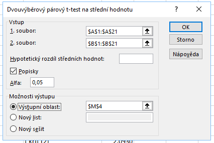

Uveďme si nyní typické zadání párového testu: *Máme data o průměrném počtu vyrobených výrobků 20 pracovníky za jednu směnu. Vedení společnosti následně provedlo změnu výrobních procesů a **pro stejných 20 pracovníků** provedlo nová měření. Ověřte na hladině významnosti $ \alpha = 5 %$, že došlo ke zvýšení průměrné produkce pracovníků.*

Klíčové v zadání je, že jsme provedli **2 sady měření pro 20 stejných pracovníků**. Můžeme tedy vždy spárovat dvě měření jednoho konkrétního pracovníka. Z toho důvodu můžeme zvolit párový t-test. Pokud bychom měli měření od různých pracovníků nebo pokud by měření byla anonymní, museli bychom zvolit jeden ze zbývajících dvou testů.

Označme si soubory jako $ X _1$ a $ X _2$ a jejich střední hodnoty jako $ \mu _{X _1}$ a $ \mu _{X _2}$. Nyní můžeme formulovat nulovou a alternativní hypotézu:

* $ H _0: \mu _{X _1} = \mu _{X _2} \, .$ (Střední hodnota obou souborů je stejná.)
* $ H _1: \mu _{X _1} < \mu _{X _2} \, .$ (Střední hodnota prvního souboru je nižší.)

Alternativní hypotézu volíme takto, protože máme dle zadání prokázat *zvýšení* průměrné produkce pracovníka (a předpokládáme, že snížení produktivity je nepravděpodobné). Provedeme tedy **levostranný test**.

Uvažujme nyní náhodnou veličinu $ Z$, kterou si definujeme jako **rozdíl náhodných veličin** $ X _1$ a $ X _2$, tj. $ Z = X _1 - X _2$. Pro každou dvojici pozorování můžeme určit $ z _i $, které je dáno jako rozdíl pozorování, tj.

$ z _i = x _{1,i} - x _{2,i} \, .$

Mají-li oba soubory stejnou střední hodnotu, pak by měla mít náhodná veličina $ Z$ nulovou střední hodnotu, tj. $ \mu _Z = 0 | H _0$. Jestliže má druhý soubor větší střední hodnotu, pak má i veličina $ Z$ ostře zápornou střední hodnotu, tj. $ \mu _Z < 0 | H _1$. Náš případ dvouvýběrového testu tedy můžeme jednoduše převést na [jednovýběrový t-test](t_test.md) provedený nad veličinou $ Z$.

Definujme si průměr pozorování veličiny $ Z$ jako $ \bar{z}$ a výběrovou směrodatnou odchylku jako  $ s _{Z}$. Nyní můžeme definovat statistiku testu $ T$ jako

$ T = \frac{\bar{z}}{s _{Z}} \sqrt{n}$

a tato veličina má $ n - 1$ stupňů volnosti. Analogicky určíme i kritický obor pro statistiku:

$ W = ( - \infty,  t _{\alpha} (n - 1) \rangle \, , $

kde $ t _{\alpha} (n - 1)$ je kvantil Studentova rozdělení s $ (n - 1)$ stupni volnosti.

Párový t-test můžeme v Excelu provést několika způsoby:

* použitím doplňku Analýza dat,
* použitím funkce T.TEST (nebo TTEST),
* použitím funkcí pro kvantilovou a distribuční funkci Studentova rozdělení.

Soubor s ukázkovými daty i všemi výpočty si [můžete stáhnout zde](media/t-test-parovy/parovy-t-test.xlsx).

### Výpočet s využitím doplňku Analýza dat

Tento doplněk jsme již používali ke generování náhodných souborů dat. Spustíte ho kliknutím na **tlačítko Analýza dat na panelu Data**. Pokud tam tlačítko nevidíte, musíte si doplněk [nainstalovat](https://support.office.com/cs-cz/article/Zaveden%C3%AD-dopl%C5%88ku-Analytick%C3%A9-v-aplikaci-Excel-6a63e598-cd6d-42e3-9317-6b40ba1a66b4). Po kliknutí na tlačítko se vám zobrazí seznam analytických nástrojů. Vyberte možnost Dvouvýběrový párový t-test na střední hodnotu. Analýza dat zvládá oboustranný i jednostranný párový t-test.


V dialogovém okně označíme oblast se dvěma soubory, a to včetně záhlaví. Pak ale nesmíme zapomenout zaškrtnout pole **Popisky**, čímž dáváme Excelu najevo, že v prvním řádku najde názvy datových souborů. Dále vyplníme výstupní oblast, pole Hypotetický rozdíl středních hodnot můžeme nechat prázdné.



Níže vidíme výsledky. Excel určil statistiku $ T = -2{,}4038$ a p-hodnotu jako $ 0{,}0133$. Na hodnotu na třetím řádku si ale musíme dát pozor. Obsahuje hranici kritické hodnoty, ta je ale vždy kladná. Protože my provádíme levostranný test, bude se kritický obor nacházet **nalevo od nuly**. K hodnotě stačí dopsat minus, protože hustota Studentova rozdělení je sudá funkce. Kritický obor vyjádřený intervalem je tedy:

$ W = ( - \infty,  - 1{,}7291 \rangle \,  .$


Doplňku Analýza dat jsme **nespecifikovali alternativní hypotézu**. Excel u jednostranného testu vždy vrací p-hodnotu, která je menší než $ 0{,}5$, tj. v našem případě vrací správně hodnotu pro levostranný test. Pokud by však průměr dat druhého souboru byl menší než průměr dat prvního, byla by statistika kladná a v tom případě by p-hodnota odpovídající této hodnotě musela být větší než $ 0{,}5$. V takovém případě by bylo třeba správnou p-hodnotu dopočítat.


### Využití funkce T.TEST (TTEST)

Excel obsahuje funkci T.TEST (v případě verze 2007 a starších funkci TTEST), která je další rychlou cestou k provedení párového t-testu. Její nevýhodou je, že vrací pouze p-hodnotu, nikoli však hodnotu statistiky a kritický obor.

V novějších verzích Excelu zadáme vzorec:

```
=T.TEST(A2:A21;B2:B21;1;1)
```

První dva parametry jsou odkazy na datové soubory, tentokrát již bez záhlaví. Třetí parametr zadáváme 1, protože požadujeme jednostranný test, pro oboustranný test bychom zvolili 2. Třetím parametrem volíme typ testu. Typy testů jsou specifikované na začátku článku. Pro párový test volíme 1, pro nepárový test se shodnými rozptyly 2 a pro nepárový test s různými rozptyly 3.

Tato funkce funguje podobně jako Analýza dat, tj. **nezadáváme mu typ jednostranného testu** a funkce vybírá tu variantu, pro kterou je p-hodnota menší než $ 0{,}5$. Chceme-li si pojistit, že výsledek bude vždy správný, můžeme provést následující úpravu:

```
=KDYŽ(F12<0;T.TEST(A2:A21;B2:B21;1;1);1-T.TEST(A2:A21;B2:B21;1;1))
```

Pokud by tedy hodnota statistiky byla kladná, použije se jednotkový doplněk k výsledku funkce T.TEST, což je správný výsledek.

Ve starších verzích Excelu použijeme funkce TTEST, parametry volíme stejné jako u novější varianty funkce:

```
=TTEST(A2:A21;B2:B21;1;1)
```

Opět můžeme provést úpravu zaručující správný výsledek i při kladné hodnotě statistiky:

```
=KDYŽ(G12<0;TTEST(A2:A21;B2:B21;1;1);1-TTEST(A2:A21;B2:B21;1;1))
```

### Manuální výpočet

Poslední variantou je manuální výpočet. Nejprve vytvoříme sloupec s rozdíly hodnot, tj. sloupec s pozorovanými hodnotami veličiny $ Z$. Dále dopočítáme průměrný rozdíl, směrodatnou odchylku, hodnoty statistiky a určíme počet dat.


Hranice kritického oboru určíme pomocí funkce kvantilové funkce Studentova rozdělení T.INV. Protože kritický obor určujeme zleva, zadáváme rovnou kvantil a počet stupňů volnosti:

```
=T.INV(F7;F2-1)
```

p-hodnotu testu určíme pomocí funkce distribuční funkce Studentova rozdělení T.DIST, které jako parametry zadáme hodnotu statistiky, počet stupňů volnosti a parametr PRAVDA, který říká, že chceme hodnotu distribuční funkce a nikoli funkce hustoty.

```
=T.DIST(F12;F2-1;PRAVDA)
```

V literatuře se uvádí, že pro větší objemy dat (zpravidla $ n \geq 30$) je možné nahradit Studentovo rozdělení normálním rozdělení. Není však chybou, pokud i pro vyšší objemy dat použijeme Studentovo rozdělení.
