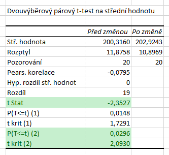
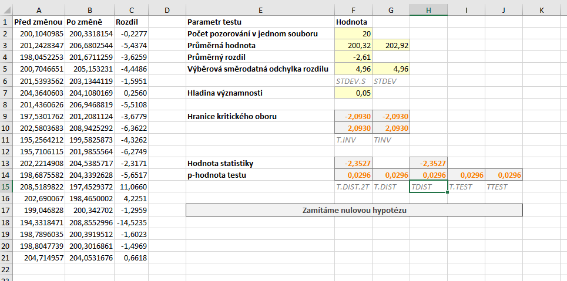

Zbývá nám poslední varianta testu a tím je oboustranný párový t-test. V případě oboustranného testu řešíme pouze to, jestli se střední hodnoty liší nebo ne. Nerozhodujeme, který ze souborů má menší a který větší střední hodnotu. Vygenerujeme si nový datový soubor, test si ukážeme na $ \alpha = 5 %$.

Hypotézy oboustranného testu jsou:

* $ H_0: \mu_{X_1} = \mu_{X_2} \, ,$
* $ H_1: \mu_{X_1} \neq \mu_{X_2} \, .$

Statistika testu zůstává stále stejná, kritický obor vyjádřený intervalem je:

$ W = ( - \infty, t_{\frac{\alpha}{2}} (n - 1) \rangle \cup \langle t_{1 - \frac{\alpha}{2}} (n - 1) , \infty )  \, . $

### Výpočet s využitím doplňku Analýza dat

Výpočet pomocí Analýzy dat se spouští stejně jako v předchozích případech. Ve výsledcích nás stále zajímá hodnota statistiky, která je nyní $ T = -2{,}3527$. Dále se podíváme na poslední dva řádky, kde vidíme p-hodnotu testu a hranici kritického oboru. Studentovo rozdělení je symetrické a tak víme, že kritický obor je

$ W = ( - \infty, -2{,}0930 \rangle \cup \langle 2{,}0930, \infty )  \, . $

Na základě p-hodnoty i na základě faktu, že hodnota statistiky se nachází v kritickém oboru, zamítáme nulovou hypotézu.



### Využití funkce T.TEST (TTEST)

Použití funkce T.TEST je v tomto případě jednoduché. Jako třetí parametr zadáváme číslo 2, které značí oboustranný test. V tomto případě není výpočet komplikovaný 2 variantami testu jako u jednostranných testů a výsledek je vždy správný.

```
=T.TEST(A2:A21;B2:B21;2;1)
```

U starší funkce TTEST platí to samé, tj. jako třetí parametr zadáváme dvojku.

```
=TTEST(A2:A21;B2:B21;2;1)
```

### Manuální výpočet

Poslední možností je manuální výpočet. Pro určení hranic kritického oboru v novějších verzích Excelu použijeme opět funkce T.INV. Dolní hranici kritického oboru určíme vzorcem

```
=T.INV(F7/2;F2-1)
```

a horní hranici

```
=T.INV(1-F7/2;F2-1)
```

Všimněte si, že použití této funkce je velmi přímočaré, protože použité kvantily odpovídají těm z vzorce pro kritický obor.

P-hodnotu nejsnadněji určíme pomocí funkce T.DIST.2T, což je distribuční funkce oboustranného Studentova rozdělení. Pouze si musíme uvědomit, že **tato funkce je vhodná pouze pro oboustranné testy**. Funkce zadáme hodnotu statistiky (obecně v absolutní hodnotě, protože funkce pracuje jen s kladnými čísly) a získáme p-hodnotu.

```
=T.DIST.2T(ABS(F13);F2-1)
```

Pokud bychom chtěli použít klasickou distribuční funkci Studentova rozdělení, pak musíme použít následující vzorec:

```
=2*MIN(T.DIST(F13;F2-1;PRAVDA);1-T.DIST(F13;F2-1;PRAVDA))
```


