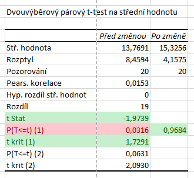
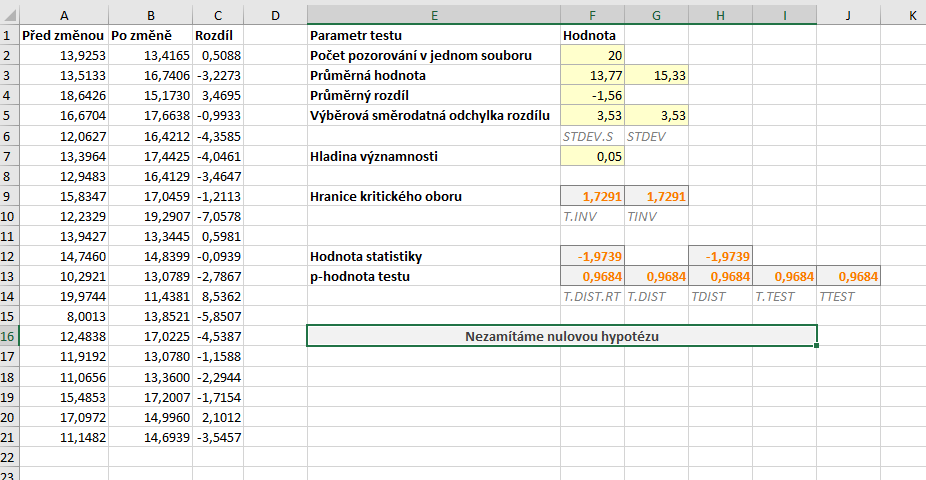

Nyní si na novém datovém souboru stručně popíšeme postup pro pravostranný párový t-test. Opět se budeme pohybovat na hladině významnosti $ \alpha = 5 %$.

Hypotézy pravostranného testu jsou:

* $ H_0: \mu_{X_1} = \mu_{X_2} \, ,$
* $ H_1: \mu_{X_1} > \mu_{X_2} \, .$

Statistika testu zůstává samozřejmě stejná, kritický obor vyjádřený intervalem pak je:

$ W = \langle t_{1 - \alpha} (n - 1) , \infty ) \, . $

Soubor s ukázkovými daty i všemi výpočty si [můžete stáhnout zde](media/t-test-parovy/parovy-t-test.xlsx).

### Výpočet s využitím doplňku Analýza dat

Výpočet pomocí Analýzy dat provádíme stejně jako v předchozím případě. Na obrázku níže vidíme výsledek. Hodnota statistiky testu je $ T = -1{,}9739$. V případě pravostranného testu je kritický obor skutečně napravo od nuly a přesný zápis kritického oboru intervalem by byl

$ W = \langle 1{,}7291 , \infty )  \, .$



V našem případě je však **špatně zobrazená p-hodnota**. Protože statistika pravostranného testu je záporná, p-hodnota musí být větší než $ 0{,}5$. Analýza dat nám zobrazuje p-hodnotu $ 0{,}0316$, to by však byla p-hodnota pro případ levostranného testu. P-hodnota pravostranného testu je $ 1 - 0{,}0316= 0{,}9684$.

### Využití funkce T.TEST (TTEST)

Podobná záludnost jako výše nás čeká i u funkcí T.TEST a TTEST. Výše už jsme si popsali úpravu, která nám zajistí, že p-hodnota testu bude vždy správná. V případě pravostranného testu stačí malá úprava: **změna znaménka nerovnosti u podmínky**.

```
=KDYŽ(F12>0;T.TEST(A2:A21;B2:B21;1;1);1-T.TEST(A2:A21;B2:B21;1;1))
```

To samé platí pro funkci TTEST.

```
=KDYŽ(G12>0; TTEST(A2:A21;B2:B21;1;1);1- TTEST(A2:A21;B2:B21;1;1))
```

### Manuální výpočet

Paradoxně jednoduše nyní může vypadat manuální výpočet v novějších verzích Excelu. Hranici kritického oboru určíme opět pomocí funkce T.INV, nyní však "odsekáváme" rozdělení statistiky zprava, protože jako kvantil zadáváme $ 1 - \alpha$:

```
=T.INV(1-F7;F2-1)
```

Pro určení p-hodnoty můžeme použít funkci T.DIST.RT, což je pravostranná distribuční funkce Studentova rozdělení:

```
=T.DIST.RT(F12;F2-1)
```

Použijeme-li nám již známou funkci T.INV, musíme samozřejmě provést odečtení hodnoty od jedničky, abychom získali p-hodnotu:

```
=1-T.DIST(F12;F2-1;PRAVDA)
```

Ve starších verzích Excelu opět použijeme funkci TINV. Odebereme ale znaménko minus, protože hranice kritického oboru je nyní kladné číslo:

```
=TINV(2*F7;F2-1)
```

Pro správné určení p-hodnoty testu opět použijeme funkci KDYŽ, oproti levostrannému testu měníme znaménko nerovnosti v podmínce:

```
=KDYŽ(H12>0;TDIST(H12;F2-1;1);1-TDIST(-H12;F2-1;1))
```


