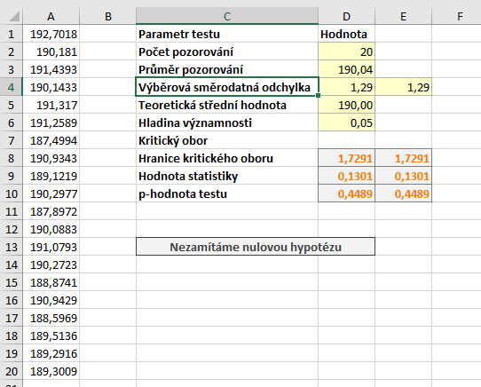

Podobně jako u [z-testu](z_test.md) můžeme i u [t-testu](t_test.md) pracovat s pravostrannou variantou testu, kdy formulujeme alternativní hypotézu jako se znaménkem "menší než".

Zadání příkladu by bylo obdobou zadání u [z-testu](z_test_pravostranny.md) s tím rozdílem, že zde neznáme směrodatnou odchylku dat a musíme ji odhadovat. Při pravostranném testu se rozhodujeme mezi těmito hypotézami:

* Nulová hypotéza: Středné hodnota souboru je 190 mm. ($latex H_0: \mu = 190 \, \mathrm{mm}$)
* Alternativní hypotéza: Střední hodnota souboru je větší než 190 mm. ($latex H_0: \mu > 190 \, \mathrm{mm}$)

## Výpočet v Excelu

Soubor s daty i výpočty si můžete stáhnout [zde](media/t-test/t-test.xlsx).

Kritický obor nyní "odsekáváme" zprava, tj. kritický obor vyjádřený intervalem má tvar

$ W = \langle t_{\alpha} \left( n - 1 \right), \infty )  \, .$

Výpočet statistiky a výběrové směrodatné odchylky zůstává stejný, určíme tedy pouze pouze hranice kritického oboru a p-hodnotu.



K určení hranice kritického oboru použijeme opět funkci T.INV, tentokrát kritický obor začíná na 95%ním kvantinu t rozdělení, tj. jako první parametr zadávání $ 1 - \alpha$:

```
=T.INV(1-D6;D2-1)
```

Hodnota statistiky je nyní 0,1301. Tato hodnota neleží v kritickém oboru, nulovou hypotézu tedy nezamítáme. K určení p-hodnoty využijeme funkci T.DIST.RT, se kterou jsme se seznámili již výše. Tato funkce vrací plochu pod funkcí hustoty od zadaného bodu směrem doprava.

```
=T.DIST.RT(D9;D2-1)
```

Alternativně můžeme využít funkci T.DIST. Tato funkce vrací obsah plochy směrem doleva. Protože celková plocha má obsah 1, potřebou hodnotu získáme odečtením výsledku funkce T.DIST od jedničky

```
=1-T.DIST(D9;D2-1;PRAVDA)
```

P-hodnota testu je 0,4489.
