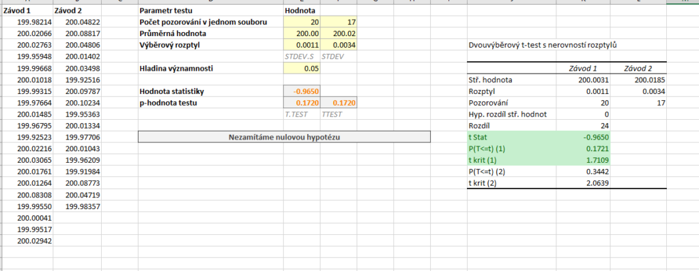
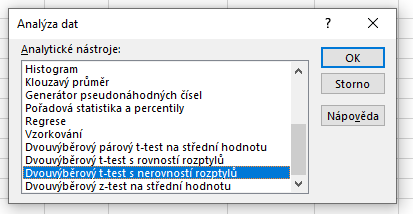
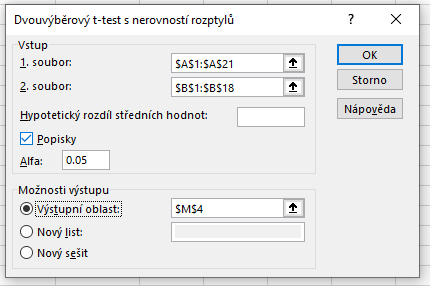
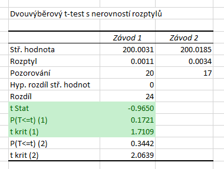

Welchův test používáme pro soubory, jejichž pozorování **nejsou spárována a nemůžeme u nich předpokládat shodný rozptyl**. V některých učebnicích statistiky je doporučeno začít s ověřením hypotézy o shodě rozptylů pomocí Fischerova testu a dle výsledku poté zvolit variantu t-testu. Tento postup však není korektní.

Abychom si ještě jednou ukázali odlišnost Welchova testu, vyjdeme ze zadání z předchozích dvou článku: *Máme data o průměrném počtu vyrobených výrobků pracovníky **ve dvou různých závodech**, přičemž v jednom ze závodů jsou testovány nové výrobní procesy. Vedení společnosti potřebuje ověřit, zda nové výrobní postupy zvýšily produktivitu práce. Ověřte na [latex] \alpha = 5 % [/latex] hypotézu, že v závodě s novými výrobními postupy vyrobí pracovníci v průměru více výrobků, než v závodě s původními postupy, přičemž předpokládáme, že **rozptyly** průměrného počtu výrobků **se mohou lišit**.*

Opět zavedeme značení: [latex] X_1 [/latex] obsahuje pozorování ze závodu se starými postupy a soubor [latex] X_2 [/latex] pozorování ze závodu s upravenými postupy. Příslušné střední hodnoty pak označíme [latex] \mu_{X_1} [/latex] a [latex] \mu_{X_2} [/latex]. Nyní můžeme formulovat nulovou a alternativní hypotézu:

* Nulová hypotéza: Střední hodnota obou souborů je stejná. ([latex] H_0: \mu_{X_1} = \mu_{X_2} [/latex])
* Alternativní hypotéza: Střední hodnota prvního souboru je nižší. ([latex] H_1: \mu_{X_1} < \mu_{X_2} [/latex])

Statistiku testu vypočteme dle vzorce

[latex] T = \frac{\bar{X_1} - \bar{X_2}}{\sqrt{\frac{s_1^2}{n_1} + \frac{s_2^2}{n_2}}} \, , [/latex]

kde [latex] \bar{X_1} [/latex] a [latex] \bar{X_2} [/latex] značí průměry, [latex] s_1^2 [/latex] a [latex] s_2^2 [/latex] výběrové rozptyly a [latex] n_1 [/latex] a [latex] n_2 [/latex] počty pozorování. Statistika má opět Studentovo (t) rozdělení. Poměrně složitý je tentokrát určení počtů stupňů volnosti, proto se ručnímu výpočtu vyhneme a provedeme výpočet pouze pomocí Analýzy dat a funkce T.TEST.

Soubor s daty i výpočty si můžete stáhnout [zde](media/welchuv-test/welschuv-test.xlsx).



## Výpočet pomocí doplňku Analýza dat

V Analýze dat tentokrát volíme možnost **Dvouvýběrový t-test s nerovností rozptylů**.



Do polí 1. soubor a 2. soubor vybereme oblasti s daty. Vybereme-li oblasti včetně záhlaví, zaškrtneme pole Popisky. Dále označíme Výstupní oblast a stiskneme tlačítko OK.



Na obrázku níže vidíme výsledky.



Protože provádíme levostranný test, zajímají nás označené řádky. Hodnota statistiky je tedy [latex] T = -0{,}9650 [/latex]. Kritický obor se nachází vlevo, proto vezmeme hranici z řádku t krit (1) a přidáme k ní tlačítko minus. Kritický obor tedy leží v intervalu [latex] W = \left( - \infty, -1{,}7109 \right\rangle [/latex]. P-hodnota testu je [latex] 0{,}1721 [/latex]. P-hodnota skutečně odpovídá naší variantě testu. Protože p-hodnota je vyšší než hladina významnosti, nezamítáme [latex] H_0 [/latex].

*Poznámka:* Statistika testu je totiž záporná a tím pádem musí být p-hodnota menší než [latex] 0{,}05[/latex]. 

## Výpočet pomocí funkce T.TEST

Funkce `T.TEST` vrací p-hodnotu testu. Prvními dvěma parametry jsou soubory s daty. Třetím parametrem je varianta testu (oboustranný nebo jednostranný), zadáváme tedy 1. Posledním parametrem volíme, zda se jedná o párový t-test (1), Studentův t-test (2) nebo Welchův test (3).

```
=T.TEST(A2:A21,B2:B18,1,3)
```

Pro naše data vrací funkce hodnotu [latex] 0{,}1721 [/latex], na základě toho bychom tedy nezamítli [latex] H_0 [/latex].

### Obecná funkce pro levostranný test

Funkce T.TEST funguje na podobném principu jako výpočet p-hodnoty u Analýzy dat, tj. vrací menší z možných dvou p-hodnot. Teoreticky by se mohlo stát, že by hodnota statistiky byla vyšší než 0 a tím pádem by p-hodnota testu byla vyšší 0,5. Funkce T.TEST však vrací vždy p-hodnotu menší než 0,5, tj. vracela by p-hodnotu pro pravostranný test. Rozhodnutí můžeme opět provést na základě hodnoty statistiky a pomocí funkce KDYŽ:

```
=KDYŽ(E8<0,T.TEST(A2:A21,B2:B18,1,3),1-T.TEST(A2:A21,B2:B18,1,3))
```

Samotný vzorec pro výpočet statistiky je 

```
=(E3-F3)/ODMOCNINA(E4/E2+F4/F2)
```
