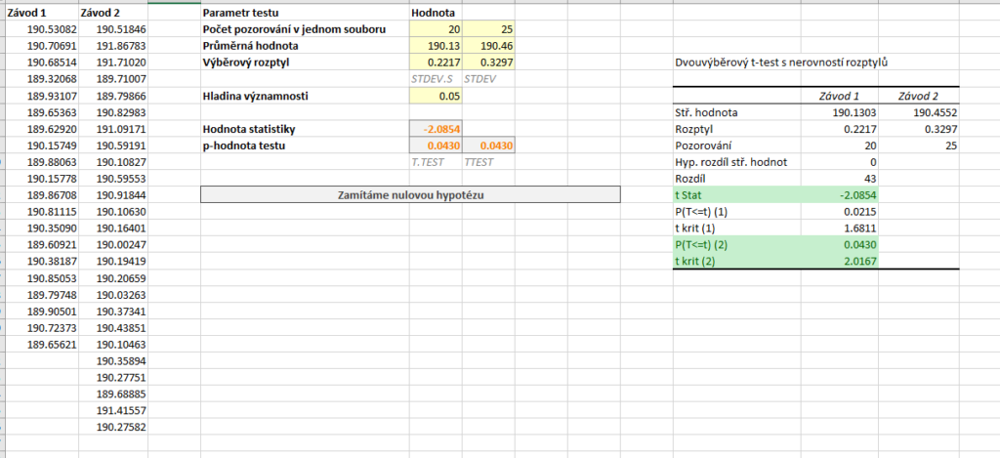
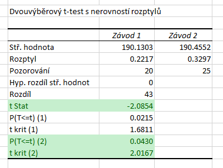

V případě oboustranného testu řešíme pouze to, zda je mezi středními hodnotami rozdíl. Vraťme se k našemu příkladu s počty vyrobených výrobků ve dvou různých závodech. Nyní tedy rozhodneme *pouze* o tom, zda se průměrné počty mezi závody *liší*.

Naše hypotézy jsou nyní:

* [latex] H_0: \mu_{X_1} = \mu_{X_2} [/latex] (Střední hodnota obou souborů je stejná.)
* [latex] H_1: \mu_{X_1} \neq \mu_{X_2} [/latex] (Střední hodnota prvního souboru je nižší.)

Soubor s daty i výpočty si můžete stáhnout [zde](media/welchuv-test-oboustranny/welschuv-test.xlsx).

Test opět provedeme na hladině významnosti [latex] \alpha = 5 % [/latex].



## Výpočet pomocí doplňku Analýza dat

Test spustíme pomocí stejného postupu jako v ostatních variantách. Hodnota statistiky testu je [latex] T = -2{,}0854 [/latex]. p-hodnotu a hranici kritického oboru nyní najdeme v posledních dvou řádcích. p-hodnota testu je [latex] 0{,}0430 [/latex]. Kritický obor je v případě oboustranného testu rozdělen na dvě části. Analýza dat nám vrací dolní hranici pravé části, horní hranici levé získáme, když před danou hranici napíšeme 0. Kritický obor je tedy [latex] W = \left( -\infty, - 2{,}0167 \right\rangle \cup \left\langle 2{,}0167, \infty \right) [/latex].



Statistika tedy leží v kritickém oboru a p-hodnota je nižší než hladina významnosti, na [latex] \alpha = 5 % [/latex] tedy zamítáme [latex] H_0 [/latex]. Tentokrát jsme však pouze prokázali, že mezi výkonností závodů existuje rozdíl, nelze však tvrdit, že v druhém závodě je výkonnost vyšší.

## Výpočet pomocí funkce T.TEST

V případě oboustranného testu zadáváme na třetí pozici číslo 2, díky čemuž nám funkce T.TEST vrátí p-hodnotu oboustranného testu. V našem případě to je tedy hodnota [latex] 0{,}0430 [/latex].

```
=T.TEST(A2:A21,B2:B26,2,3)
```

V případě oboustranného testu je vrácená hodnota vždy správná a funkci již nemusíme nijak upravovat.
