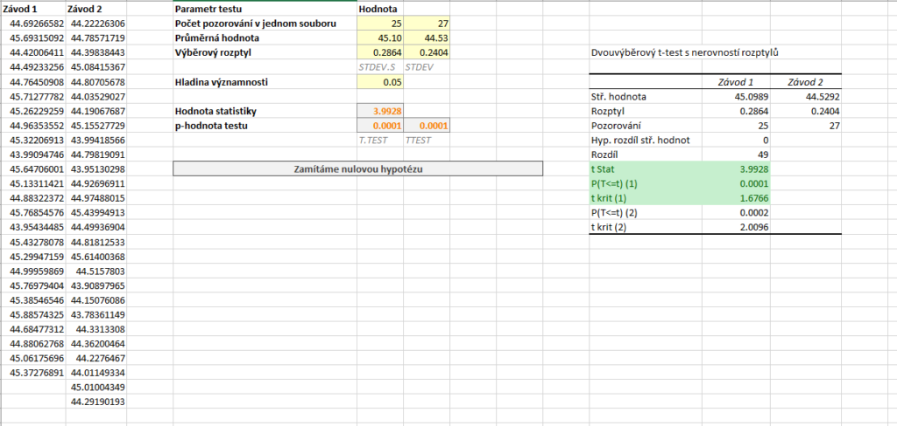
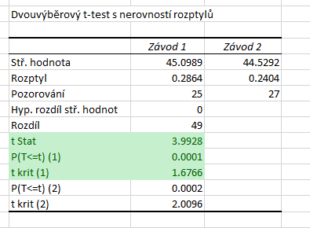

Uvažujme nyní, že máme obdobné zadání, máme však data o průměrné době potřebné na výrobu jednoho výrobku. Pokud by technologické postupy v novém závodě byly efektivnější, průměrná doba výroby by měla být nižší. Data jsou v tabulce níže.

Modifikujeme alternativní hypotézu a získáme dvojici hypotéz:

* [latex] H_0: \mu_{X_1} = \mu_{X_2} [/latex]
* [latex] H_1: \mu_{X_1} > \mu_{X_2} [/latex]

Hladina významnosti je stále [latex] \alpha = 5 % [/latex].

Soubor s daty i výpočty si můžete stáhnout [zde](media/welchuv-test-pravostranny/welschuv-test.xlsx).



### Výpočet pomocí doplňku Analýza dat

Postup výpočtu je naprosto stejný jako u levostranného testu. Pro aktuální data máme výstup na obrázku níže.



Hodnota statistiky je nyní [latex] T = 3{,}9928 [/latex]. Kritický obor se nachází vpravo, proto hranici najdeme v řádku t krit (1) a tentokrát ji nijak neupravujeme. Kritický obor tedy leží v intervalu [latex] W = \left\rangle 1{,}6766 , \infty \right) [/latex]. Vidíme, že statistika lež v kritickém oboru. p-hodnota testu je [latex] 0{,}0001 [/latex], zamítáme tedy [latex] H_0 [/latex]. Na [latex] \alpha = 5 % [/latex] jsme prokázali, že výroba ve druhém závodě je rychlejší.

## Výpočet pomocí funkce T.TEST

Zápis funkce je opět stejný, tj.:

```
=T.TEST(A2:A26,B2:B28,1,3)
```

Funkce vrací p-hodnotu testu, což je [latex] 0{,}0001[/latex]. Nulovou hypotézu bychom opět zamítli.

Pokud bychom opět chtěli obecný vzorec, který si poradí i s p-hodnotami vyššími než 0,5, upravíme jej o podmínku na základě hodnoty statistiky:

```
=KDYŽ(E8>0,T.TEST(A2:A26,B2:B28,1,3),1-T.TEST(A2:A26,B2:B28,1,3))
```

Sestavení této podmínky je vyvětlené v [předchozím článku](welchuv_test.md).
