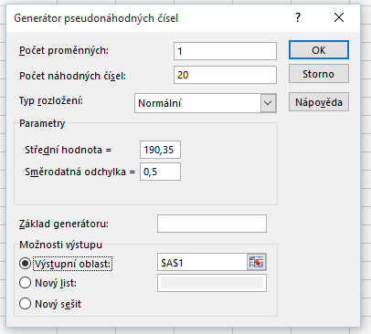
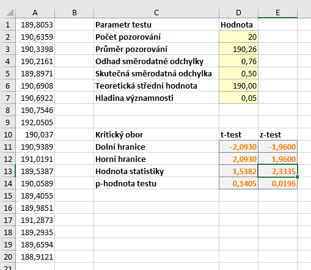
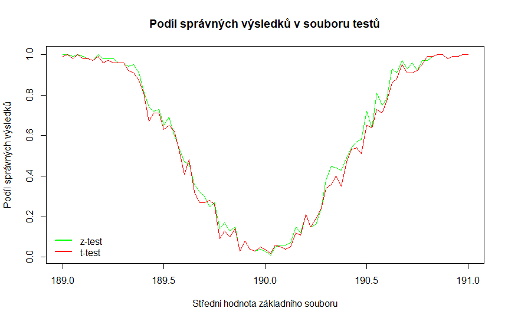

V předcházejících článcích jsme rozebírali [z-test](z_test.md) a [t-test](t_test.md). Oba testy slouží k otestování hypotézy o střední hodnotě a liší se pouze předpokladem o znalosti rozptylu. Nabízí se ale otázka, k čemu vlastně máme dva testy? **Jakou výhodu vlastně přináší znalost rozptylu?** Na to se nyní podíváme.

U obou dvou testů můžeme testovat hypotézy na stejných hladinách významnosti. Ať už tedy provedeme test pomocí z-testu nebo t-testu, můžeme si předem stanovit, že pravděpodobnost chyby 1. druhu (neoprávněného zamítnutí $ H_0 $) je například $ \alpha = 5 % $. Neznalost rozptylu se ale projeví **v pravděpodobnosti chyby 2. druhu**, neboli v **síle testu**. V případě využití t-testu máme větší pravděpodobnost, že nezamítneme neplatnou $ H_0 $.

Ukažme si to na příkladu oboustranného testu. Předpokládejme stejné hypotézy jako v předchozích článcích, tj.

* $ H_0: \mu = 190 \, $,
* $ H_1: \mu \neq 190 \, $.

Vygenerujeme si soubor pomocí generátoru náhodných čísel. Ten nám vygeneruje čísla s požadovanými vlastnostmi. Budeme chtít data se střední hodnotou $ \mu = 190,35 $ a směrodatnou odchylkou $ \sigma = 0,5$. Víme tedy, že nulová hypotéza neplatí. Pokud tedy nulovou hypotézu při testu zamítneme, bude náš výsledek správný. V opačném případě se dopouštíme chyby 2. druhu.

Na obrázku níže máte vygenerovaná data a výsledky provedených testů.

p-hodnota z-testu je 0,0196, p-hodnota t-testu je 0,1405. Na hladině významnosti $ \alpha = 5 % $ bychom tedy nulovou hypotézu zamítli pouze při použití z-testu. V případě použití t-testu bychom se dopustili chyby 2. druhu.

Soubor s výpočty si můžete stáhnout [zde](media/z-t-test-porovnani/t-test1.xlsx).

Na základě jednoho příkladu ale nejde vyvozovat nějaké obecnější závěry. Zkusme tedy komplexnější experiment. Využijeme soubor náhodných čísel, který jsme vytvořili pro [analýzu síly testu z-testu](jak_vznikaji_chyby.md).

V souboru jsme měli náhodné výběry se střední hodnotou od $ \mu =189$ do $ \mu =191$ a směrodatnou odchylkou $ \sigma= 0,9$. Velikostí kroku mezi dvěma středními hodnotami byla 0,025. Rozsah náhodného výběru byl 20 a pro každou střední hodnotu jsme generovali 100 náhodných výběrů. Budeme pro každý soubor testovat hypotézu $ H_0: \mu = 190$ na hladině významnosti $ \alpha = 5 %$, a to jak pomocí z-testu, tak i pomocí t-testu.

Výsledek experimentu je na obrázku níže. Obě křivky zobrazují podíl správných výsledků (tj. zamítnutí $ H_0: \mu = 190$) v souboru provedených testů. Pro z-test je požita zelená barva, pro t-test červená. Červená křivka se nachází pod zelenou, což značí, že z-test je úspěšnější než t-test.

.

Soubor s experimenty si můžete stáhnout [zde](media/z-t-test-porovnani/z-test-vs-t-test.xlsx).
