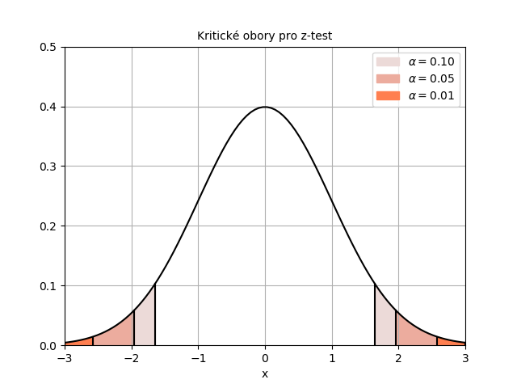
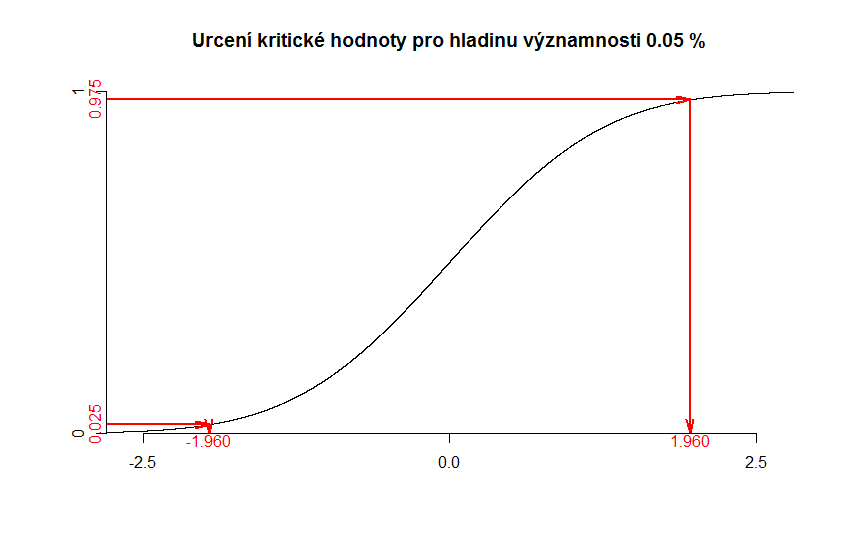

V případě jednovýběrového z-testu uvažujeme, že máme **jeden statistický soubor dat**, známe  **známe rozptyl dat** a chceme **ověřit hypotézu o jeho střední hodnotě**. Pokud rozptyl neznáme (a musíme ho odhadovat), využijeme [t-test](t_test.md). Protože z-test je jedním z nejjednodušších statistických testů, vysvětlíme si na něm detailně, jak se statistické testování provádí, jaké má testování výstupy a jak je interpretujeme.

# Zadání příkladu

Uvažujme následující příklad: _Máme zařízení, které vyrábí součástku určité délky a víme, jaká je chybovost tohoto zařízení. Nařízení bylo nastaveno pracovníkem a my chceme ověřit, že tento pracovník nastavil správnou délku součástky. Změříme tedy několik součástek a na základě měření rozhodneme o správnosti nastavení zařízení. Požadovaná délka je 190 mm a směrodatná odchylka délky součástek je 0,9 mm._

Při testování nejprve musíme formulovat hypotézu, která odpovídá tomu, co potřebujeme ověřit. Formulujeme vždy tzv. **nulovou a alternativní hypotézu**. V našem případě máme hypotézy:

* Nulová hypotéza: Střední hodnota statistického souboru **je** 190 mm.
* Alternativní hypotéza: Střední hodnota statistického souboru **není** 190 mm

Nulová a alternativní hypotéza musí být vzájemně vždy **ve sporu**, tj. nikdy nemohou platit obě zároveň. Pokud formulujeme alternativní hypotézu tímto způsobem, označujeme to jako **oboustranný test**. Vedle toho existuje ještě [levostranný test](z_test_levostranny.md) a [pravostranný test](z_test_pravostranny.md).

Znalost [rozptylu](rozptyl.md) je důležitým předpokladem pro použití z-testu. Pokud rozptyl neznáme, můžeme využít [t-test](t_test.md).

V praxi určitě nenaměříme délku přesně 190 mm, protože pozorování reality je zatíženo určitou náhodou, v našem případě je to chybovost stroje. Pointa testování hypotéz spočívá v rozhodnutí, jestli rozdíl mezi teoretickou a naměřenou hodnotou je tak velký, že už **nemůže být vysvětlený náhodou**. Uvažujme například, že naměříme průměr 189,5 cm. Je to důsledkem chybovosti stroje nebo důkaz jeho špatného nastavení? Přesně o tom rozhodneme pomocí testování hypotéz.

Testování můžeme zakončit dvěma způsoby:

* *Zamítneme* nulovou hypotézu. To znamená, že prohlásíme, že rozdíl mezi hypotetickou střední hodnotou a skutečně naměřeným průměrem je tak velký, že s největší pravděpodobnostní nemohl být způsoben náhodou.
* *Nezamítneme* nulovou hypotézu. Nikdy neříkáme, že nulovou hypotézu přijímáme. Zdůvodnění je níže.

Je zřejmé, že jedna z těchto hypotéz musí platit. Testování hypotézy vždy provádíme na určité **hladině významnosti**. Než si tento pojem vysvětlíme, uvědomme si, že v závěru našeho testu můžeme udělat dvě chybná rozhodnutí:

* *Zamítneme nulovou hypotézu, i když platí.* V našem případě bychom prohlásili, že pracovník nastavil zařízení špatně, i když ve skutečnosti bylo nastavené dobře. Tuto chybu nazýváme **chyba 1. druhu**.
* *Nezamítneme nulovou hypotézu, i když neplatí.* V našem případě bychom prohlásili, že pracovník nenastavil zařízení chybně, i když nastavení ve skutečnosti chybné bylo. Takovou chybu nazýváme **chyba 2. druhu**. Pravděpodobnost této chyby ale neznáme. Proto nepoužíváme výrok "přijímáme nulovou hypotézu", protože u takového výroku bychom nevěděli, jak velkou pravděpodobností chyby je zatížen.

*Tip:* Pro větší přehlednost se možné situace často [zapisují do tabulky](chyby_pri_testovani.md).

**Pravděpodobnost chyby 1. druhu** si zvolíme sami a právě velikost této pravděpodobnosti nazýváme **hladina významnosti**. Standardně se hladina významnosti volí jako 5 % nebo 1 %. 

## Statistika testu a kritický obor

Každý test má svoji **testovou statistiku**, většinou známe její rozdělení. Na základě rozdělení a námi zvolené hladině významnosti určíme, které hodnoty statistiky znamenají nezamítnutí testové hypotézy a které již vedou k její zamítnutí. U každé statistiky víme, jakých hodnot může nabývat. Rozdělme si tyto hodnoty na dvě části: **obor přijetí** a **kritický obor**. Platí, že tyto části se nijak nepřekrývají a pokrývají veškeré hodnoty, kterých může statistika nabýt.

V případě z-testu má statistika **normované normální rozdělení**. Hodnota veličiny normovaného normálního rozdělení může být libovolné reálné číslo, proto na obor hodnot a kritický obor rozdělujeme celou množinu reálných čísel.

Vysvětleme si, jak se tyto hodnoty určí, na příkladu hladiny významnosti 5 %. Protože známe rozdělení statistiky, můžeme určit, jakou hodnotu bude mít tato statistika s pravděpodobností 95 %, jestliže naše nulová hypotéza platí. "Odsekněme" tedy zbývající hodnoty, které celkově nastanou s pravděpodobností 5 %. Protože normální rozdělení je symetrické, odsekáváme stejný rozsah hodnot z obou stran. Obě krajní hodnoty jsou si v absolutní hodnotě rovny. Jedna z nich je kladná a druhá záporná.

Na obrázku níže vidíte, jak se mění rozsah oboru přijetí a kritického oboru v závislosti na hladině významnosti.

Nyní už zbývá vypočítat skutečnou hodnotu této statistiky a poté rozhodnout o zamítnutí či nezamítnutí nulové hypotézy.

Vraťme se k zadání našeho příkladu. Uvažujme, že máme k dispozici 20 měření a testování budeme provádět na hladině významnosti [latex] \alpha = 5 % [/latex]. Soubor s daty a výsledky testu naleznete zde: [z-test-data](media/z-test/z-test-data.xlsx).

## Statistika testu

Statistika testu je vzorec, který se dá snadno najít v literatuře nebo na internetu. Pro z-test má následující tvar:

[latex] Z = \frac{\bar{x} - \mu_0}{\sigma} \sqrt{n} \, , [/latex]

kde [latex] \bar{x} [/latex] je průměr našeho výběru, [latex] \mu_0 [/latex] je testovaná střední hodnota (v našem případě 190), [latex] \sigma [/latex] je směrodatná odchylka základního souboru (v našem případě 0,9) a [latex] n [/latex] je počet pozorování (v našem případě 20).

## Určení kritického oboru

Statistika [latex] Z [/latex] má normované normální rozdělení. Kritické hodnoty nemůžeme zjistit z hodnot distribuční funkce, ale potřebujeme **inverzní funkci k distribuční funkci**, která se označuje jako **kvantilová funkce**. Proč? Vysvětleme si to pomocí obrázku níže. Na ni máme distribuční funkci normovaného normálního rozdělení. Distribuční funkce nám pro nějakou hodnotu [latex] x [/latex] říká, s jakou pravděpodobností bude náhodně vybraná hodnota menší než toto [latex] x [/latex]. Např. víme, že pro číslo 0 je hodnota distribuční funkce 0,5. Máme tedy padesátiprocentní pravděpodobnost, že náhodně vybrané číslo bude záporné. Pomocí doplňku k jedničce bychom snadno zjistili, že je stejně tak pravděpodobnost 0,5, že náhodně vybrané číslo bude kladné.

My však potřebujeme opačnou informaci. Potřebujeme vědět, které číslo [latex] x_1 [/latex] je hraniční a náhodně vybraná hodnota bude menší než toto [latex] x_1 [/latex] s pravděpodobností 0,025 (případně pro jaké [latex] x_2 [/latex] platí, že náhodně zvolená hodnota bude větší než toto [latex] x_2 [/latex]). My tedy pro nějaké číslo z osy [latex] x [/latex] nezjišťujeme hodnotu funkce na ose [latex] y [/latex], ale naopak pro nějakou hodnotu funkce[latex] y [/latex] hledáme [latex] x [/latex] k ní příslušné.

Inverzní funkce právě toto "obrácené čtení" umožňuje. Proto tedy tuto funkci využijeme. Hranice kritického oboru můžeme zjistit například v Excelu. Pro dolní hranici kritického oboru zadáme do buňky v Excelu vzorec.

<pre>=NORM.INV(0,05/2;0;1)</pre>

a pro horní hranici

<pre>=NORM.INV(1-0,05/2;0;1)</pre>

Normované normální rozdělení je symetrické kolem nuly, proto se hodnoty v absolutní hodnotě rovnají.

## Kritický obor zapsaný intervalem

Obecný vzorec pro kritický obor je

[latex] W = ( - \infty ; u_{\frac{\alpha}{2}} \rangle\cup \langle u_{1-\frac{\alpha}{2}} ; \infty )\, . [/latex]

Pro naši konkrétní hladinu významnosti [latex] \alpha = 5 % [/latex] pak získáme

[latex] W = ( - \infty ; u_{0.025} \rangle\cup \langle u_{0.975}; \infty ) = ( - \infty ; -1,960 \rangle \cup \langle 1,960; \infty ) \, , [/latex]

kde funkce [latex] u_p [/latex] je kvantilová funkce normovaného normálního rozdělení.

[Zde](z_test_excel.md) si můžete přečíst, jak provést výpočet v Excelu.
