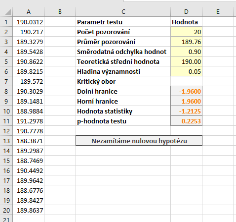
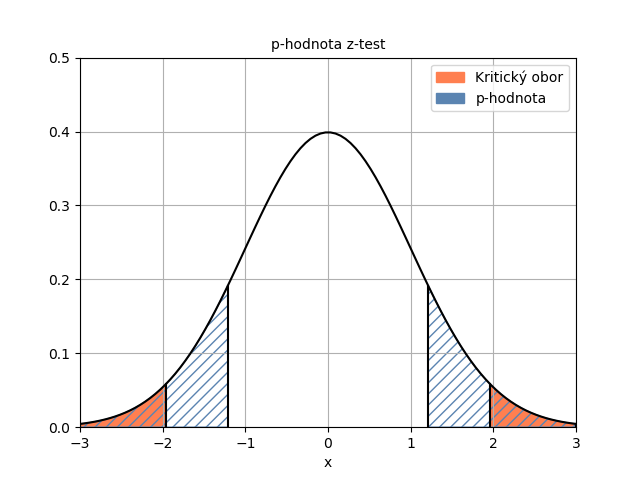

V tomto článku je popsáno, jak provést z-test v Excelu. Zadání příkladu a teoretický popis včetně vzorců najdete v článku o [z-testu](z_test.md).

Všechna data a výpočty si můžete stáhnout [zde](media/z-test-excel/z-test_data.xlsx). Na ukázkovém listu máme data v buňkách A1 až A20. Do buňky D2 si umístíme počet pozorování. Můžeme tam přímo zadat hodnotu 20, případně použít funkci POČET. Průměr pozorování zjistíme vzorcem

<pre>=PRŮMĚR(A1:A20)</pre>

a uložíme ho v buňce D3. Směrodatnou odchylku zapíšeme do D4, teoretickou střední hodnotu do D5 a hladinu významnosti do D6. Hranice kritického oboru, které jsme si určili výše, uložíme do D8 a D9.

Nyní můžeme určit hodnotu statistiky pomocí vzorce:

<pre>=(PRŮMĚR(A1:A20)-D5)/D4*ODMOCNINA(D2)</pre>

Protože ještě budeme zadávat vzorec pro p-hodnotu, uložte hodnotu statistiky do buňky D10.

Hodnota statistiky [latex] Z = -1,2125 [/latex]. Tato hodnota je mimo kritický obor, proto nulovou hypotézu nezamítáme.

## Určení p-hodnoty

V současné době se při testování hypotéz často využívá **p-hodnota**. p-hodnota je **mezní hladina významnosti, pro kterou ještě nulovou hypotézu nezamítáme**. Pokud je **p-hodnota větší nebo rovna než hladina významnosti**, nulovou hypotézu **nezamítáme.**

Podívejme-se na následující obrázek. Na něm vidíme p-hodnotu jako modrou šrafovanou plochu, což je plocha od hodnoty statistiky směrem vlevo. V případě našeho oboustranného testu musíme uvažovat i stejně velkou plochu napravo.

p-hodnotu určíme pomocí distribuční funkce normálního rozdělení. Hodnotu statistiky máme v buňce D10. Pro hodnoty distribuční funkce v Excelu použijeme funkci NORM.DIST, přičemž jako čtvrtý parametr zadáváme hodnotu PRAVDA. Pokud bychom zadali hodnota NEPRAVDA, získáme hodnotu funkce hustoty. Hodnotu distribuční funkce potřebujeme pro hodnotu statistiky. Protože uvažujeme i stejně velkou plochu v pravé části, násobíme výsledek funkce dvěma:

<pre>=NORM.DIST(D10;0;1;PRAVDA)*2</pre>
