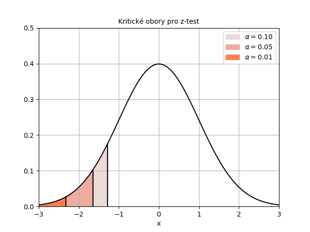
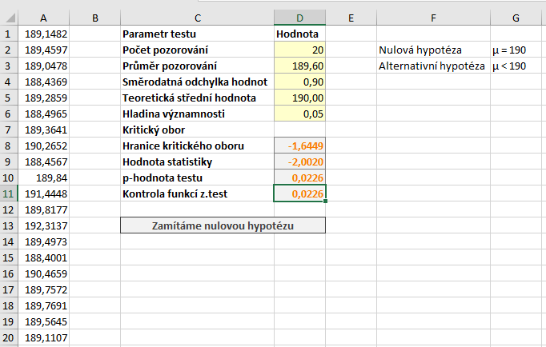
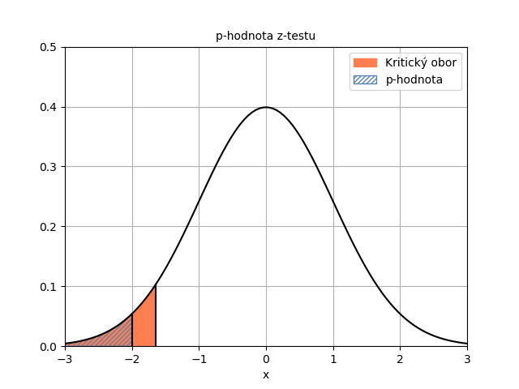

Uvažujme, že chceme ověřit hypotézu o střední hodnotě nějakého náhodného výběru, k čemuž můžeme využít z-test. U [oboustranného z-testu](z-test.md) je alternativní hypotéza zadaná nerovností, tj. alternativní hypotéza tvrdila, že střední hodnota náhodného výběru je *odlišná* od teoretické (testované) střední hodnoty. Nyní rozebereme další variantu - levostranný test, kde ověřujeme, zda je skutečná střední hodnota dat **menší** než hypotetická hodnota.

Uvažujme upravené zadání našeho příkladu: *Máme zařízení, které vyrábí součástku určité délky. Směrodatná odchylka délky součástek v důsledku chybovosti zařízení je 0,9 mm. Požadovaná délka součástky je 190 mm. Pracovník nemůže zadat k výrobě delší součástku, v důsledku chybného zadání ale mohou být vyráběny kratší součástky. Ověřte, zda bylo zařízení správně nastaveno.*

V tomto příkladu uvažujeme, že průměrná délka součástky může být menší než 190 mm, neuvažujeme ale, že by mohla být větší. Formulujme tedy hypotézy:

* Střední hodnota statistického souboru je 190 mm. ($ H_0: \mu = 190 \, \mathrm{mm} $)
* Střední hodnota statistického souboru je menší než 190 mm. ($ H_1: \mu < 190 \, \mathrm{mm} $.)

Statistika zůstává stejná:

$ Z = \frac{\bar{x} - \mu_0}{\sigma} \sqrt{n} \, ,$

přičemž $ \bar{x}$ je průměr našeho vzorku, $ \mu_0$ je teoretická (testovaná) střední hodnota, $ \sigma$ je směrodatná odchylka základního souboru a $ n$ je rozsah náhodného výběru. Statistika má opět normované normální rozdělení.

##  Kam umístit kritický obor

Naše alternativní hypotéza [latex] H_1 [/latex] tvrdí, že skutečná střední hodnota je menší než 190 mm. Jestliže [latex] H_1 [/latex] platí, pak bude s větší pravděpodobností průměr vzorku menší než 190. Nižší hodnota $ \bar{x}$ než 190 znamená, že rozdíl $ \bar{x} - \mu_0$ je záporný. Protože $ \sigma$ a $ n$ jsou vždy kladné, záporná hodnota tohoto rozdílu znamená, že i hodnota statistiky je záporná. Z toho plyne, že záporné hodnoty statistiky hovoří spíše ve prospěch alternativní hypotézy. **Čím je hodnota statistiky menší, tím větší tendenci máme k zamítnutí nulové hypotézy.**

## Hladina významnosti a možné závěry

Kritické obory pro hladinu významnosti $ \alpha = 5 %$, $ \alpha = 1 % $ a $ \alpha = 10 % $ naleznete na obrázku níže.



Je důležité si uvědomit, že plocha kritického oboru je stále [latex] 0{,}05 [/latex]. To způsobuje hranice kritického oboru (kritická hodnota) pro stejnou hladinu významnosti je "více vpravo" oproti kritickému oboru oboustranného testu (porovnejte si to s kritickými obory u [oboustranného z-testu](z-test.md)).


## Výpočet z-testu v Excelu

Podívejme se nyní, jak by se z-test provedl v aplikaci Microsoft Excel. Testovat budeme na $ \alpha = 5 %$. Využijeme list, který jsme použili pro oboustranný test, provedeme pouze několik modifikací.




Máme pouze jednu hranici kritického oboru, která je daná vzorcem

```
=NORM.S.INV(D6)
```

Kritický obor vyjádřený intervalem má tvar:

$ W = u_{0,05} = ( - \infty, -1,6449 \rangle \, , $


kde $ u_{0,05} $ označujeme pětiprocentní kvantil normovaného normálního rozdělení. 

Dále upravíme vzorec pro výpočet p-hodnoty

```
=NORM.S.DIST(D9;PRAVDA)
```

Hodnota statistiky je -2,0020, tj. statistika leží v kritickém oboru. V tomto případě tedy můžeme konstatovat, že jsme na hladině významnosti $ \alpha = 5 % $ prokázali, že střední hodnota délky součástky je menší než 190. Zařízení tedy bylo nastaveno chybně.

Výsledek potvrzuje i p-hodnota, která je nižší než hladina významnosti. Porovnání je na obrázku níže. p-hodnota je plocha pod hustotou statistiky od minus nekonečna až po vypočtenou hodnotu statistiky.



K provedení testu můžeme využít i funkci Z.TEST. Tato funkce standardně vrací p-hodnotu pravostranného testu. Protože my provádíme levostranný test, p-hodnotu získáme odečtením výsledku funkce Z.TEST od jedničky.

```
=1-Z.TEST(A1:A20;D5;D4)
```

Pokud bychom odečtení od jedničky neprovedli, získali bychom plochu zelené oblasti na obrázku níže. Protože provádíme levostranný test, chceme znát plochu pod funkcí hustoty nalevo od hodnoty statistiky. Ta je na obrázku vyznačena modře.
