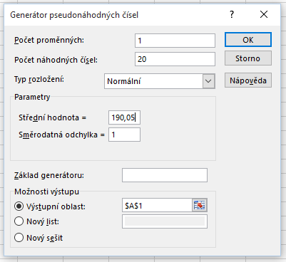

Oproti [příkladu s levostranným testem](z_test_levostranny.md) uvažujme nyní opačný případ, tj. kontrolujeme, zda pracovník nastavil **vyšší** délku součástky než 190 mm. Možnost, že by součástky byly kratší, nyní neuvažujeme. Taková varianta testu je označovaná jako pravostranný test.

V případě pravostranného testu máme následující hypotézy:

* Střední hodnota statistického souboru je 190 mm. ($latex H_0: \mu = 190 \, \mathrm{mm} $)
* Střední hodnota statistického souboru je větší než 190 mm. ($latex H_1: \mu > 190 \, \mathrm{mm} $)

Kritický obor se nyní nachází vpravo.


## Výpočet z-testu v Excelu

Excel soubor s testem je zde: [z-test data](media/z-test-pravostranny/p-hodnota.pngz-test-data.xlsx).

Budeme opět testovat na $latex \alpha = 5 %$. Oproti předchozímu testu máme jinou hranici kritického oboru, která je daná vzorcem

```
=NORM.S.INV(1-D6)
```

Protože normované normální rozdělení je symetrické kolem nuly, je kritická hodnota v absolutní hodnotě stejná jako u předchozí varianty, liší se ale znaménkem.

Kritický obor vyjádřený intervalem má tvar:

$latex W = u_{0,95} = \left( - \infty, 1,6449 \right\rangle \, , $

kde $latex u_{0{,}95} $ označuje 95%ní kvantil normovaného normálního rozdělení. Průběh testu vidíte na obrázku níže. Na $latex \alpha = 5 %$ nulovou hypotézu nezamítáme.


Protože funkce Z.TEST standardně provádí právě pravostranný test, je její použití jednoduché:

```
=Z.TEST(A1:A20;D5;D4)
```

Další možností je získání výsledku pomocí distribuční funkce normálního rozdělení. p-hodnotu nyní tvoří plocha vpravo od hodnoty statistiky. K získání p-hodnoty tedy odečteme hodnotu distribuční funkce od jedničky.

```
=1-NORM.S.DIST(D9,PRAVDA)
```

Výsledek si můžeme zobrazit i graficky.


Nepodařilo by se nám tedy prokázat, že by byl stroj chybně nastaven.

*Poznámka:* Nyní si ještě jednou ukážeme, proč bychom se měli výroku o pravdivosti nulové hypotézy vyhnout. Jak ukazuje obrázek níže, střední hodnota dat byla ve skutečnosti o něco vyšší než 190 mm, konkrétně 190,05 mm. Takto malou chybu se nám tedy nepodařilo odhalit. 


